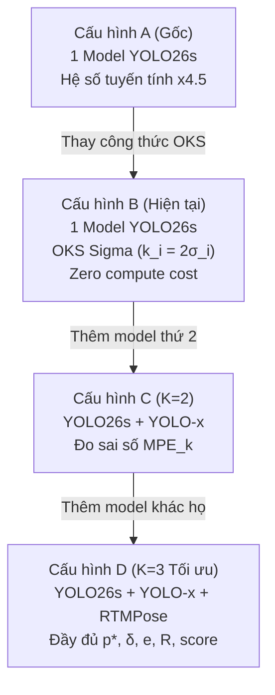

# CHIẾN LƯỢC MULTI-MODEL ENSEMBLE TRONG LANDMARK QA

Tài liệu thiết kế chi tiết về phương pháp **Ensemble Đa Mô hình (Multi-Model Ensemble)** nhằm nâng cao độ chính xác, ước lượng độ bất định mô hình (Epistemic Uncertainty) và tự động phân loại ca khó (*hard_case*) trong bài toán kiểm định chất lượng nhãn Landmark/Pose.

---

## 1. Đặt vấn đề: Tại sao 1 Model là chưa đủ?

Trong phiên bản ban đầu, hệ thống sử dụng duy nhất một mô hình (`yolo26s-pose.pt`) làm chuẩn tham chiếu:
* **Hạn chế 1 (Cảnh báo oan - False Positives):** Khi gặp ảnh mờ, góc chụp khuất hoặc tư thế dị biệt, chính model AI cũng dự đoán sai. Hệ thống không có căn cứ để tự phản biện nên vẫn phạt người gán nhãn, gây ức chế cho reviewer.
* **Hạn chế 2 (Không đo được độ tự tin thực sự):** Confidence score nội bộ ($conf$) của mạng nơ-ron thường bị over-confident (tự tin thái quá ngay cả khi đoán sai).
* **Hạn chế 3 (Heuristic cảm tính):** Công thức cũ nhân tỷ lệ lệch với hệ số `4.5` không có cơ sở giải phẫu học, coi sai số ở mắt (nhỏ, nhạy cảm) tương đương với sai số ở hông/vai (lớn, dung sai rộng).

**Giải pháp Multi-Model (K Giám khảo):** Kết hợp $K \ge 3$ model AI độc lập để thu được hai giá trị cốt lõi:
1. **Vị trí tham chiếu đồng thuận ($p^*_i$):** Tốt hơn bất kỳ model đơn lẻ nào.
2. **Độ bất đồng giữa các model ($\delta_i$):** Đo lường trực tiếp mức độ khó/mơ hồ của vùng ảnh để tránh báo oan.

---

## 2. Nền tảng Toán học & Bộ Công thức Chi tiết

### 2.1. Vị trí tham chiếu tối ưu (Weighted Consensus Position)

Tọa độ đồng thuận của khớp $i$ được tính bằng trung bình có trọng số kép:

$$p^*_i = \frac{\sum_{k=1}^K w_k\,c_{k,i}\,p_{k,i}}{\sum_{k=1}^K w_k\,c_{k,i}}$$

Trong đó:
* $p_{k,i} = (x_{k,i}, y_{k,i})$: Tọa độ khớp $i$ do model $k$ dự đoán.
* $c_{k,i} \in [0, 1]$: Độ tin cậy (confidence) của khớp $i$ từ model $k$.
* $w_k = \frac{1}{\text{MPE}_k^2}$: Trọng số tĩnh của model $k$, tính theo **Nghịch đảo Phương sai (Inverse-Variance Weighting)**.
  * $\text{MPE}_k$ (Median Normalized Pose Error): Sai số chuẩn hóa trung vị của model $k$ đo một lần trên tập chuẩn COCO val. Model càng chính xác thì $w_k$ càng lớn, model yếu tự động bị giảm tầm ảnh hưởng.

---

### 2.2. Độ bất đồng giữa các Model (Model Disagreement / Uncertainty)

Độ phân tán không gian giữa các model phản ánh độ bất định của AI:

$$\delta_i = \frac{1}{s}\sqrt{\frac{\sum_{k=1}^K w_k c_{k,i}\,\lVert p_{k,i}-p^*_i\rVert^2}{\sum_{k=1}^K w_k c_{k,i}}}$$

* $s = \sqrt{W \cdot H}$ hoặc $\sqrt{(x_2 - x_1)(y_2 - y_1)}$: Kích thước bounding box của người để chuẩn hóa tỉ lệ khoảng cách (bất biến với độ phân giải ảnh).
* Khi $K = 1$ (chỉ 1 model): $\delta_i = 0$.
* Khi các model đồng thuận cao: $\delta_i \to 0$.
* Khi các model bất đồng ý kiến (vùng ảnh mờ/bị che): $\delta_i$ tăng cao.

---

### 2.3. Điểm nghi ngờ chuẩn hóa OKS (Suspicion Score)

Thay thế hệ số `4.5` bằng phân phối xác suất hàm mũ dựa trên **COCO OKS (Object Keypoint Similarity)**:

$$e_i = 1 - \exp\!\left(-\frac{(d_i/s)^2}{2\,(k_i^2 + \lambda\,\delta_i^2)}\right)$$

Trong đó:
* $d_i = \lVert h_i - p^*_i\rVert$: Khoảng cách giữa điểm người gán ($h_i$) và điểm tham chiếu đồng thuận ($p^*_i$).
* $k_i = 2\sigma_i$: Dung sai chuẩn của khớp $i$ (dựa trên độ lệch chuẩn COCO $\sigma_i$).
* $\lambda \ge 1$: Hệ số điều tiết ảnh hưởng của độ bất đồng (mặc định khởi điểm = $1.0$).
* **Cơ chế tự thích ứng:**
  * Nếu các model đồng thuận ($\delta_i \approx 0$), mẫu số chỉ còn $2 k_i^2$, điểm nghi ngờ phản ánh thuần túy sai lệch của người gán.
  * Nếu các model bất đồng ($\delta_i$ lớn), mẫu số tăng lên $\rightarrow$ **điểm nghi ngờ $e_i$ tự động giảm xuống**, tránh bắt lỗi khi chính AI cũng không chắc chắn.

#### Bảng tra cứu hệ số dung sai giải phẫu $\sigma_i$ (Chuẩn COCO 17 khớp):
| Khớp ID | Tên khớp | $\sigma_i$ | Dung sai $k_i = 2\sigma_i$ | Ý nghĩa giải phẫu |
|:---:|:---|:---:|:---:|:---|
| 1 | `nose` | 0.026 | 0.052 | Nhỏ, vị trí xác định rõ ràng |
| 2, 3 | `r_eye`, `l_eye` | 0.025 | 0.050 | Rất nhỏ, sai lệch pixel dễ thấy |
| 4, 5 | `r_ear`, `l_ear` | 0.035 | 0.070 | Trung bình nhỏ |
| 6, 7 | `r_shoulder`, `l_shoulder` | 0.079 | 0.158 | Lớn, bả vai biên độ rộng |
| 8, 9 | `r_elbow`, `l_elbow` | 0.072 | 0.144 | Trung bình lớn |
| 10, 11 | `r_wrist`, `l_wrist` | 0.062 | 0.124 | Trung bình |
| 12, 13 | `r_hip`, `l_hip` | 0.107 | 0.214 | Rất lớn, tâm xương chậu khó định vị chính xác |
| 14, 15 | `r_knee`, `l_knee` | 0.087 | 0.174 | Lớn |
| 16, 17 | `r_ankle`, `l_ankle` | 0.089 | 0.178 | Lớn |

---

### 2.4. Độ tin cậy của Đánh giá ($R_i$) & Phân loại Ca khó

Độ tin cậy của nhận định được đo bằng:

$$R_i = \bar{c}_i \cdot \exp\!\left(-\frac{\delta_i^2}{2\tau^2}\right)$$

* $\bar{c}_i = \frac{\sum_k w_k c_{k,i}}{\sum_k w_k}$: Độ tin cậy trung bình có trọng số từ các model.
* $\tau \in [0.05, 0.10]$: Ngưỡng dung sai bất đồng.

#### Ma trận Phân loại Trực quan:
```
                 e_i Cao (Sai lệch lớn so với AI)
                            ▲
                            │
       [Ca khó / Hard Case] │ [LỖI NGƯỜI GÁN THẬT]
       - AI bất đồng cao    │ - AI đồng thuận cao
       - R_i thấp           │ - R_i cao
       - Gắn cờ xem xét     │ - Ưu tiên duyệt Top đầu
  ──────────────────────────┼────────────────────────► R_i Cao
       [Bỏ qua / Ổn]        │ [Nhãn Chuẩn Xác]
       - Sai lệch nhỏ       │ - Cả người và AI trùng khớp
       - R_i thấp           │ - R_i cao
                            │
```

---

### 2.5. Xếp hạng Danh sách Cảnh báo (Top-K Ranking Score)

Điểm xếp hạng tổng hợp để hiển thị lên bảng review bên trái giao diện:

$$\text{score}_i = e_i \cdot R_i^\alpha \qquad (\alpha \approx 0.5)$$

* Điểm số này giúp đưa các lỗi **vừa có độ lệch lớn ($e_i$ cao), vừa có sự đồng thuận tuyệt đối từ các model ($R_i$ cao)** lên vị trí số 1 của danh sách.

---

## 3. Lộ trình Triển khai & Kiểm chứng (4 Cấu hình)



### Chi tiết các Cấu hình:

| Cấu hình | Số lượng Model ($K$) | Công thức áp dụng | Chi phí tính toán | Trạng thái |
|:---|:---:|:---|:---:|:---:|
| **A. Baseline** | 1 (YOLO26s) | $raw = \min(1, dist\_norm \times 4.5) \times conf$ | $1\times$ | *Đã thay thế* |
| **B. OKS Sigma** | 1 (YOLO26s) | $e_i = 1 - \exp\left(-\frac{(d_i/s)^2}{2(2\sigma_i)^2}\right) \times conf$ | $1\times$ (Không tốn thêm) | **ĐÃ TÍCH HỢP** |
| **C. K=2** | 2 (YOLO26s + YOLOv8x) | Tính $p^*$, $\delta$, đo độ nhạy $K=2$ | $2.5\times$ | *Bước kế tiếp* |
| **D. K=3 (Mục tiêu)** | 3 (YOLO26s + YOLO-x + RTMPose) | Đầy đủ bộ công thức $p^*, \delta, e, R, score$ | $3\times - 4\times$ | *Hoàn thiện* |

---

## 4. Benchmark Chứng minh: Phương pháp Tiêm lỗi Giả (Synthetic Noise Injection)

Để có số liệu học thuật chứng minh sự vượt trội của cấu hình mới, quy trình đo lường như sau:

1. **Tập dữ liệu chuẩn:** Trích xuất 100 ảnh có nhãn chuẩn từ tập COCO 2017 validation (`vf_humanpose17_v1`).
2. **Tiêm lỗi nhân tạo (Ground Truth Mislabels):**
   * *Nhiễu Gaussian nhỏ:* Lệch $0.05 \times s$ (mô phỏng click lệch tay).
   * *Nhiễu lớn:* Lệch $0.20 \times s$ (mô phỏng gán nhầm điểm/vị trí).
   * *Nhiễu hoán đổi:* Đổi chỗ cặp đối xứng (mắt trái $\leftrightarrow$ mắt phải).
3. **Chỉ số đánh giá:**
   * **AUROC:** Diện tích dưới đường cong ROC (đo khả năng phân biệt điểm đúng vs điểm bị tiêm lỗi).
   * **Precision@K (P@K):** Trong top $K$ cảnh báo đầu tiên mà hệ thống gợi ý, có bao nhiêu % thực sự là lỗi bị tiêm.
   * **Recall@K (R@K):** Tỷ lệ bắt được bao nhiêu % tổng số lỗi đã tiêm.

---

## 5. Các Vấn đề Kỹ thuật Cần Xử lý khi Chạy K=3

1. **Ghép người đồng thời (K-way Person Matching):**
   * Khi ảnh có nhiều người, cần ghép cặp giữa người gán nhãn với từng model:
     $$\text{Person}_{\text{human}} \longleftrightarrow \text{Person}_{\text{Model 1}} \longleftrightarrow \text{Person}_{\text{Model 2}} \longleftrightarrow \text{Person}_{\text{Model 3}}$$
   * Dùng ma trận khoảng cách tâm cụm điểm keypoint hoặc IoU bounding box để liên kết.
2. **Xử lý khi có Model bỏ sót người (Missed Detection):**
   * Nếu ở một ảnh đông người, Model 3 không phát hiện ra người đó $\rightarrow$ Tập model hợp lệ $\mathcal{K}_{\text{valid}} = \{1, 2\}$.
   * Vẫn tính $p^*_i$ trên tập $\mathcal{K}_{\text{valid}}$, nhưng áp dụng hệ số phạt độ tin cậy $R_i = R_i \times \frac{|\mathcal{K}_{\text{valid}}|}{K}$ để cảnh báo tình trạng thiếu giám khảo.
3. **Cơ chế Offline Adapter (Giải phóng tải phần cứng):**
   * Với máy tính cá nhân không có GPU khủng, hệ thống hỗ trợ nạp file kết quả JSON dự đoán sẵn từ Google Colab hoặc server GPU từ xa theo đúng schema nội bộ mà không bắt backend local phải chạy cùng lúc 3 model nặng.
