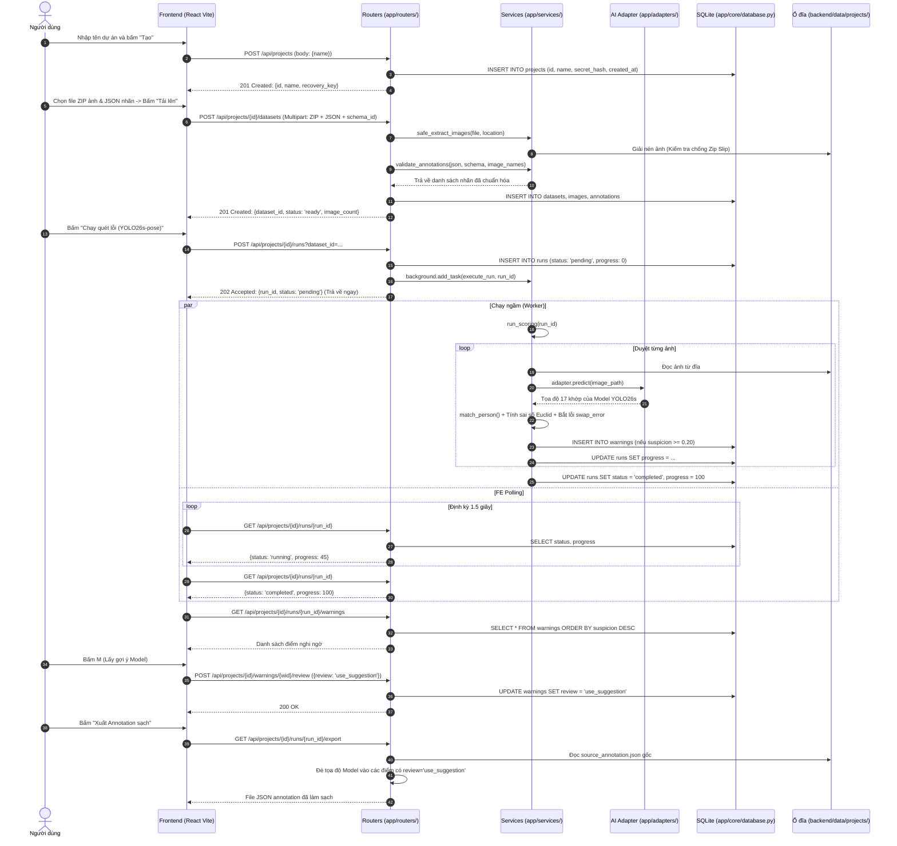

# TÀI LIỆU KIẾN TRÚC VÀ TOÀN BỘ LUỒNG HOẠT ĐỘNG BACKEND

**Dự án:** Landmark Quality Assurance (Landmark QA)  
**Phạm vi:** Backend (FastAPI + SQLite + Model AI YOLO26s-pose)  
**Phiên bản cấu trúc:** Modular Layered Architecture

---

## MỤC LỤC

1. [Tổng quan Kiến trúc & Phân bổ Thư mục](#1-tổng-quan-kiến-trúc--phân-bổ-thư-mục)
2. [Sơ đồ Luồng Tổng thể (Sequence Diagram)](#2-sơ-đồ-luồng-tổng-thể-sequence-diagram)
3. [Luồng 1: Khởi tạo Dự án & Cơ chế Xác thực (Auth & Project)](#3-luồng-1-khởi-tạo-dự-án--cơ-chế-xác-thực-auth--project)
4. [Luồng 2: Tiếp nhận, Giải nén & Thẩm định Dữ liệu (Dataset Ingestion)](#4-luồng-2-tiếp-nhận-giải-nén--thẩm-định-dữ-liệu-dataset-ingestion)
5. [Luồng 3: Kích hoạt Quét lỗi Chạy ngầm & Cơ chế Polling (Run & Polling)](#5-luồng-3-kích-hoạt-quét-lỗi-chạy-ngầm--cơ-chế-polling-run--polling)
6. [Luồng 4: Chi tiết Thuật toán So khớp & Chấm điểm Nghi ngờ (Scoring Engine)](#6-luồng-4-chi-tiết-thuật-toán-so-khớp--chấm-điểm-nghi-ngờ-scoring-engine)
7. [Luồng 5: Hiển thị Trực quan & Stream Dữ liệu lên Canvas (Visualization)](#7-luồng-5-hiển-thị-trực-quan--stream-dữ-liệu-lên-canvas-visualization)
8. [Luồng 6: Phản hồi Quyết định Review (K/M/S) & Xuất Annotation Sạch (Export)](#8-luồng-6-phản-hồi-quyết-định-review-kms--xuất-annotation-sạch-export)
9. [Bảng Tra cứu Tổng hợp Endpoint ](#9-bảng-tra-cứu-tổng-hợp-endpoint--hàm--file)$\rightarrow$[ Hàm ](#9-bảng-tra-cứu-tổng-hợp-endpoint--hàm--file)$\rightarrow$[ File](#9-bảng-tra-cứu-tổng-hợp-endpoint--hàm--file)

---

## 1. Tổng quan Kiến trúc & Phân bổ Thư mục

Backend được xây dựng theo mô hình **Modular Layered Architecture** (Kiến trúc phân tầng mô-đun) của FastAPI. Toàn bộ mã nguồn nằm trong thư mục `backend/app/`:

```text
backend/
├── yolo26s-pose.pt             # File trọng số model AI (23 MB)
├── configs/
│   └── schemas/                # Các file định nghĩa khung xương (Keypoint Schemas)
│       ├── vf_humanpose17_v1.json
│       └── vf_face_landmark50_v1.json
├── data/                       # Thư mục lưu trữ nội bộ
│   ├── landmark_qa.sqlite3     # Database SQLite
│   └── projects/               # Lưu file ảnh & annotation gốc của từng Project
└── app/
    ├── main.py                 # Điểm khởi động (Entry point): CORS, Lifecycle, gắn Routers
    │
    ├── core/                   # Tầng lõi hệ thống & hạ tầng
    │   ├── config.py           # Khai báo hằng số môi trường (ROOT, DATA_DIR, MAX_UPLOAD...)
    │   ├── database.py         # Kết nối SQLite & migration cấu trúc bảng
    │   └── security.py         # Xác thực Bearer token, băm SHA-256
    │
    ├── schemas/                # Tầng định nghĩa dữ liệu (Pydantic DTOs)
    │   ├── project.py          # CreateProject
    │   └── warning.py          # ReviewWarning
    │
    ├── services/               # Tầng xử lý logic nghiệp vụ nặng (Business Logic)
    │   ├── dataset_service.py  # Giải nén ZIP an toàn (chống Zip Slip), validate nhãn COCO/VF
    │   ├── scoring.py          # THUẬT TOÁN CHẤM ĐIỂM: So khớp tọa độ, tính độ lệch, bắt lỗi swap
    │   └── mock_service.py     # Bộ điều phối chạy ngầm & dữ liệu mẫu giả lập
    │
    ├── routers/                # Tầng tiếp nhận API (API Controllers)
    │   ├── projects.py         # /api/projects
    │   ├── datasets.py         # /api/projects/{id}/datasets
    │   ├── runs.py             # /api/projects/{id}/runs
    │   └── warnings.py         # /api/projects/{id}/warnings, review, export
    │
    └── adapters/               # Lớp cắm Model AI tự do (Model-Agnostic Adapter)
        └── yolo_pose.py        # Adapter bọc YOLO26s, ánh xạ keypoint COCO -> VinFast
```

---

## 2. Sơ đồ Luồng Tổng thể (Sequence Diagram)



---

## 3. Luồng 1: Khởi tạo Dự án & Cơ chế Xác thực (Auth & Project)

### Bước 1.1: Tiếp nhận yêu cầu tạo Project

- **Frontend gửi:**
  - Request: `POST http://127.0.0.1:8000/api/projects`
  - Body: `{"name": "Dự án xe VF8 - Lô 1"}`
- **Router tiếp nhận:**
  - File: `backend/app/routers/projects.py`
  - Hàm: `create_project(payload: CreateProject)`
- **Thực thi trong Backend:**
  1. Sinh `project_id = str(uuid.uuid4())`.
  2. Sinh mã khóa phục hồi an toàn: `recovery_key = secrets.token_urlsafe(32)`.
  3. Băm khóa bảo mật: gọi hàm `digest(recovery_key)` tại `backend/app/core/security.py` sử dụng thuật toán **SHA-256**.
  4. Mở kết nối Database qua hàm `db()` tại `backend/app/core/database.py`.
  5. Thực hiện câu lệnh SQL:
    ```sql
     INSERT INTO projects VALUES (project_id, name, secret_hash, created_at)
    ```
- **Response trả về FE:**
  - HTTP Status: `201 Created`
  - JSON: `{"id": "...", "name": "...", "recovery_key": "..."}`
  - *Lưu ý:* FE lưu chuỗi `recovery_key` vào `localStorage` của trình duyệt.

### Bước 1.2: Cơ chế bảo vệ các API bằng `project_guard`

Tất cả các API thao tác dữ liệu (upload, run, xem ảnh, review) đều gắn kèm cơ chế phụ thuộc (Dependency Injection):

- File: `backend/app/core/security.py`
- Hàm: `project_guard(project_id: str, authorization: str, token: str)`
- **Quy trình kiểm tra:**
  1. Trích xuất token từ Header `Authorization: Bearer <recovery_key>` (hoặc query param `?token=...` khi load thẻ ``).
  2. Băm token gửi lên bằng SHA-256: `digest(secret)`.
  3. So khớp với `secret_hash` lưu trong bảng `projects` bằng hàm `secrets.compare_digest()` để chống tấn công phân tích thời gian (Timing Attack).
  4. Nếu không khớp $\rightarrow$ ném ra lỗi `HTTP 403 Forbidden`.

---

## 4. Luồng 2: Tiếp nhận, Giải nén & Thẩm định Dữ liệu (Dataset Ingestion)

- **Frontend gửi:**
  - Request: `POST /api/projects/{project_id}/datasets`
  - Header: `Authorization: Bearer <recovery_key>`
  - Body (Multipart Form):
    - `file`: File ZIP chứa ảnh (`train_01.jpg`, `train_02.jpg`, ...).
    - `schema_id`: Chuỗi định danh schema, ví dụ `"vf_humanpose17_v1"`.
    - `annotation_file`: File JSON nhãn đi kèm.
- **Router tiếp nhận:**
  - File: `backend/app/routers/datasets.py`
  - Hàm: `upload_dataset()`

### Quy trình 3 bước xử lý tại Backend:

#### Bước 2.1: Giải nén an toàn (Safe Extraction)

- File: `backend/app/services/dataset_service.py`
- Hàm: `safe_extract_images(upload: UploadFile, destination: Path)`
- **Thuật toán & Bảo mật:**
  - Ghi tạm luồng upload vào file `source.zip`. Nếu dung lượng vượt quá `MAX_UPLOAD_BYTES` (500 MB) $\rightarrow$ lập tức ngắt và ném lỗi `HTTP 413`.
  - Mở `zipfile.ZipFile`: Đếm tổng số file, nếu vượt `MAX_FILES_PER_ZIP` (10.000 file) $\rightarrow$ chặn để chống tấn công **Zip Bomb**.
  - **Chống lỗ hổng Zip Slip (Path Traversal):**
    ```python
    path = PurePosixPath(info.filename)
    if info.is_dir() or path.is_absolute() or ".." in path.parts:
        continue  # Bỏ qua tuyệt đối không cho ghi đè file hệ thống
    ```
  - Lọc định dạng ảnh cho phép: chỉ chấp nhận đuôi nằm trong tập `IMAGE_EXTENSIONS = {".jpg", ".jpeg", ".png", ".webp"}`.
  - Nếu bên trong ZIP có sẵn file `.json` chứa nhãn $\rightarrow$ tự động đọc nhãn nhúng (embedded annotation).

#### Bước 2.2: Thẩm định và Chuẩn hóa cấu trúc nhãn

- File: `backend/app/services/dataset_service.py`
- Hàm 1: `load_schema(schema_id)` $\rightarrow$ đọc file cấu hình tại `backend/configs/schemas/vf_humanpose17_v1.json`.
- Hàm 2: `validate_annotations(payload, schema, image_names)`
- **Thuật toán hỗ trợ đa định dạng:**
  - **Trường hợp 1 (COCO Keypoints 1.0 xuất từ CVAT):**
    - Hệ thống tự động nhận diện cấu trúc có `images`, `annotations`, `categories`.
    - Đọc từ điển ánh xạ `COCO_TO_VF17` trong `backend/app/adapters/yolo_pose.py`:
      - Chuẩn COCO mặc định left trước right; chuẩn VinFast quy định right trước left (ID chẵn: right, ID lẻ: left).
      - Chuyển đổi mã trạng thái: `v=0` $\rightarrow$ `"outside"` (tọa độ null), `v=1` $\rightarrow$ `"occluded"` (bị che), `v=2` $\rightarrow$ `"visible"` (nhìn rõ).
  - **Trường hợp 2 (Định dạng nội bộ `landmark-qa/v1`):**
    - Kiểm tra từng ảnh: Bắt buộc phải có đủ 17 ID khớp (`1` đến `17`).
    - Điểm `"outside"` bắt buộc `x = null, y = null`.
    - Điểm `"visible"` hoặc `"occluded"` bắt buộc phải là số thực (float/int).

#### Bước 2.3: Lưu trữ đĩa và Cơ sở dữ liệu SQLite

- File ảnh được lưu cố định tại thư mục vật lý:  
`backend/data/projects/<project_id>/datasets/<dataset_id>/images/`
- File nhãn gốc được lưu thành:  
`backend/data/projects/<project_id>/datasets/<dataset_id>/source_annotation.json`
- Ghi dữ liệu vào SQLite:
  - Bảng `datasets`: Lưu metadata bộ dữ liệu (tên, đường dẫn lưu trữ, schema_id, số lượng ảnh).
  - Bảng `images`: Lưu danh sách ảnh và kích thước `width`, `height`.
  - Bảng `annotations`: Lưu chuỗi JSON chứa danh sách keypoints của người gán.
- **Response trả về FE:**
  - `{"id": dataset_id, "name": "...", "status": "ready", "image_count": 20, "schema_id": "vf_humanpose17_v1"}`

---

## 5. Luồng 3: Kích hoạt Quét lỗi Chạy ngầm & Cơ chế Polling (Run & Polling)

Khi người dùng bấm nút **"Chạy quét lỗi (YOLO26s-pose)"**:

```
[FE: Bấm nút] ──► POST /api/projects/{id}/runs ──► [BE: Tạo Run trong DB]
                                                         │
                                                         ├─► [Phản hồi ngay 202 Accepted] ──► [FE: Bắt đầu Polling]
                                                         │
                                                         └─► [BackgroundTasks: Gọi execute_run()] ──► [AI Worker]
```

### Bước 3.1: Tiếp nhận yêu cầu Run

- **Endpoint:** `POST /api/projects/{project_id}/runs?dataset_id={dataset_id}`
- **Router:** `backend/app/routers/runs.py` $\rightarrow$ hàm `create_run()`
- **Xử lý:**
  1. Tạo `run_id = str(uuid.uuid4())`.
  2. Ghi bản ghi vào bảng `runs` với trạng thái ban đầu: `status = 'pending', progress = 0`.
  3. Thêm hàm thực thi vào luồng ngầm của FastAPI:
    ```python
     background.add_task(execute_run, run_id)
    ```
  4. **Phản hồi ngay lập tức cho FE (Non-blocking):**
    - Trả về HTTP `202 Accepted`: `{"id": run_id, "status": "pending", "mode": "real"}`.

### Bước 3.2: Bộ điều phối chạy ngầm

- File: `backend/app/services/mock_service.py`
- Hàm: `execute_run(run_id: str)`
- **Logic điều phối:**
  - Đọc `schema_id` của dataset liên quan từ bảng `datasets`.
  - Nếu `schema_id == "vf_humanpose17_v1"`: Gọi thuật toán chấm điểm AI thật:
    ```python
    from app.services.scoring import run_scoring
    run_scoring(run_id, db, load_schema)
    ```
  - Nếu không phải (hoặc có lỗi ngoại lệ): Fallback gọi `make_mock_results(run_id)` để đảm bảo luồng giao diện không bao giờ bị đứng.

### Bước 3.3: Vòng lặp Polling cập nhật tiến độ

- Trong khi worker đang chạy ngầm, Frontend kích hoạt vòng lặp `setInterval` mỗi 1.5 giây:
  - Request: `GET /api/projects/{project_id}/runs/{run_id}`
  - Router: `backend/app/routers/runs.py` $\rightarrow$ hàm `get_run()`
  - Database trả về: `{id, status: "running", progress: 65, dataset_id}`
  - FE cập nhật thanh tiến trình % hiển thị cho người dùng.
  - Khi `status == "completed"`, FE dừng vòng lặp polling và chuyển sang hiển thị màn hình Review.

---

## 6. Luồng 4: Chi tiết Thuật toán So khớp & Chấm điểm Nghi ngờ (Scoring Engine)

Đây là **trọng tâm tính toán thông minh nhất của Backend**, được thực thi trong hàm:

- File: `backend/app/services/scoring.py`
- Hàm: `run_scoring(run_id: str, db_factory, schema_loader)`

Thuật toán thực hiện tuần tự qua các bước:

```
[Ảnh từ ổ đĩa] ──► [YOLO26s Adapter Predict] ──► [Danh sách người & keypoints Model]
                                                               │
[Nhãn người gán từ DB] ────────────────────────────────────────┼──► [1. Ghép người: match_person()]
                                                               │
                                                               ├──► [2. Tính scale: compute_person_scale()]
                                                               │
                                                               ├──► [3. Tính khoảng cách Euclid chuẩn hóa]
                                                               │
                                                               ├──► [4. Bắt lỗi đối xứng: swap_error]
                                                               │
                                                               └──► [5. Gắn cờ cảnh báo nghi ngờ >= 0.20]
```

### Bước 4.1: Model AI suy luận trích xuất Keypoint

- File: `backend/app/adapters/yolo_pose.py`
- Lớp: `YoloPoseAdapter`
- Model nạp: `backend/yolo26s-pose.pt` (thông qua thư viện `ultralytics.YOLO`)
- Hàm gọi: `adapter.predict(image_path)`
- **Chi tiết thực thi:**
  1. Chạy suy luận trên CPU: `results = self.model.predict(source=image_path, verbose=False, device="cpu")`.
  2. Lấy danh sách tọa độ các hộp người `boxes.xyxy` và độ tin cậy `boxes.conf`.
  3. Lấy mảng keypoints kích thước $(N, 17, 2)$ và độ tự tin của từng điểm khớp `keypoints.conf`.
  4. Duyệt qua từ điển `COCO_TO_VF17`, chuyển đổi toàn bộ 17 khớp chuẩn COCO sang định dạng chuẩn của VinFast với key là ID khớp ($1 \dots 17$).

### Bước 4.2: Thuật toán Ghép người (Person Matching)

Trong một bức ảnh có thể có nhiều người. Cần phải ghép đúng người mà người gán nhãn đã chấm với người mà Model AI phát hiện được:

- Hàm: `match_person(human_points, predicted_persons)`
- **Thuật toán:**
  1. Tính tâm cụm điểm của người do con người gán (chỉ tính các điểm có tọa độ khác null):
    $$
    \bar{X}_H = \frac{1}{K}\sum_{i=1}^{K} x_i, \quad \bar{Y}_H = \frac{1}{K}\sum_{i=1}^{K} y_i
    $$
  2. Duyệt qua danh sách các người do Model dự đoán ($P_1, P_2, \dots$):
    - Tính tâm của Bounding Box do Model tìm thấy:  
     $$cx = \frac{x_1 + x_2}{2}, \quad cy = \frac{y_1 + y_2}{2}$$
    - Tính khoảng cách Euclid giữa tâm nhãn người và tâm Model:
      $$
      D = \sqrt{(\bar{X}_H - cx)^2 + (\bar{Y}_H - cy)^2}
      $$
  3. Chọn người của Model có khoảng cách $D$ nhỏ nhất ($\min D$) để ghép cặp so sánh.

### Bước 4.3: Chuẩn hóa kích thước người (Person Scale Normalization)

- Hàm: `compute_person_scale(bbox, image_w, image_h)`
- **Vấn đề thực tế:** Nếu người đứng gần camera (người rất to), việc lệch 10 pixel là bình thường. Nhưng nếu người đứng ở rất xa (người bé xíu), lệch 10 pixel là sai lệch hoàn toàn khỏi khớp cơ thể.
- **Công thức chuẩn hóa:**
  - Lấy diện tích Bounding Box của người:
    $$
    W = x_2 - x_1, \quad H = y_2 - y_1
    $$
    $$
    scale = \sqrt{W \times H}
    $$
  - Mọi khoảng cách lệch tọa độ sẽ được chia cho giá trị $scale$ này để đưa về sai số tương đối không phụ thuộc vào cự ly xa/gần.

### Bước 4.4: Công thức tính Độ nghi ngờ cơ bản (Raw Suspicion Score)

Với mỗi điểm khớp thứ $i$:

1. Nếu điểm có trạng thái là `"outside"` hoặc tọa độ bằng `null` $\rightarrow$ **Bỏ qua không so sánh**.
2. Tính khoảng cách (pixel) hình học Euclid giữa tọa độ người gán $(hx, hy)$ và tọa độ model gợi ý $(mx, my)$:
  $$
  dist = \sqrt{(hx - mx)^2 + (hy - my)^2}
  $$
3. Chuẩn hóa khoảng cách theo kích thước cơ thể:
  $$
  dist\_norm = \frac{dist}{scale}
  $$
4. Tính độ nghi ngờ thô (nhân với độ tin cậy $conf$ của model tại khớp đó):
  $$
  raw\_suspicion = \min(1.0, dist\_norm \times 4.5) \times conf_{model}
  $$
   *Hệ số 4.5 được tinh chỉnh thực nghiệm để khi sai số vượt quá 22% chiều dài cơ thể thì độ nghi ngờ đạt mức tối đa 1.0.*

### Bước 4.5: Thuật toán Bắt lỗi Hoán đổi Trái - Phải (Swap Error Detection)

Lỗi phổ biến nhất của người gán nhãn là nhầm lẫn bên trái và bên phải của người đối diện:

- Danh sách cặp đối xứng: `PAIR_LOOKUP`
  - Khớp mắt: (2, 3), Khớp tai: (4, 5)
  - Khớp vai: (6, 7), Khớp khuỷu tay: (8, 9), Khớp cổ tay: (10, 11)
  - Khớp hông: (12, 13), Khớp đầu gối: (14, 15), Khớp cổ chân: (16, 17)
- **Thuật toán kiểm tra:**
  - Giả sử xét khớp cổ tay phải $H_R$ và khớp đối xứng là cổ tay trái $H_L$.
  - Tọa độ Model tương ứng là $M_R$ và $M_L$.
  - Tính tổng khoảng cách hiện tại:
    $$
    orig\_dist = \text{dist}(H_R, M_R) + \text{dist}(H_L, M_L)
    $$
  - Thử hoán đổi chéo vị trí:
    $$
    swap\_dist = \text{dist}(H_R, M_L) + \text{dist}(H_L, M_R)
    $$
  - **Điều kiện bắt lỗi:**
    $$
    \text{Nếu } swap\_dist < 0.6 \times orig\_dist \quad \text{VÀ} \quad orig\_dist > 0.15 \times scale
    $$
    $\rightarrow$ Nghĩa là nếu đổi ngược nhãn trái/phải lại mà khoảng cách khớp lại **giảm hơn 40%**, thì chắc chắn người gán nhãn đã dán nhầm bên!
  - **Hành động:**
    - Đặt loại cảnh báo: `warning_type = "swap_error"`.
    - Đẩy vọt độ nghi ngờ lên mức báo động đỏ: $suspicion = \max(suspicion, 0.88)$.

### Bước 4.6: Xử lý điểm bị che khuất (Occluded Handling)

- Nếu người gán đã chủ động đánh dấu khớp là `"occluded"` (bị khuất sau vật cản):
  - Hệ thống hiểu đây là ca khó cho cả người lẫn model.
  - Phân loại: `warning_type = "hard_case"`.
  - Hạ mức ưu tiên cảnh báo: $suspicion = suspicion \times 0.5$ để nhường sự chú ý cho các điểm sai rõ ràng khác.

### Bước 4.7: Lưu cảnh báo vào Database

- Lọc ngưỡng cảnh báo: Chỉ những điểm có $suspicion \ge 0.20$ mới được lưu.
- Lưu vào bảng `warnings`:
  - `id`: UUID cảnh báo.
  - `run_id`: Mã đợt chạy.
  - `image_name`: Tên file ảnh (vd `train_15.jpg`).
  - `keypoint`: Tên khớp (vd `r_wrist`).
  - `warning_type`: `suspected_error` / `swap_error` / `hard_case`.
  - `suspicion`: Điểm số từ 0.20 đến 1.0 (sắp xếp giảm dần).
  - `human_x, human_y`: Tọa độ do con người dán.
  - `suggested_x, suggested_y`: Tọa độ do Model YOLO26s gợi ý.
  - `review`: Mặc định là `null` (chờ người kiểm duyệt bấm nút).

---

## 7. Luồng 5: Hiển thị Trực quan & Stream Dữ liệu lên Canvas (Visualization)

Khi màn hình Review của Frontend mở ra:

### Bước 5.1: Tải danh sách cảnh báo

- **Request:** `GET /api/projects/{project_id}/runs/{run_id}/warnings`
- **Router:** `backend/app/routers/warnings.py` $\rightarrow$ hàm `list_warnings()`
- **SQL:** `SELECT * FROM warnings WHERE run_id = ? ORDER BY suspicion DESC`
- **Response:** Danh sách JSON các điểm nghi ngờ xếp từ điểm cao nhất xuống.

### Bước 5.2: Tải thông tin khung xương đầy đủ của bức ảnh

- **Request:** `GET /api/projects/{project_id}/runs/{run_id}/images/{image_name}/keypoints`
- **Router:** `backend/app/routers/warnings.py` $\rightarrow$ hàm `get_image_keypoints()`
- **Response:** Trả về toàn bộ tọa độ gốc của con người trong ảnh đó cùng danh sách các cặp cạnh khung xương (`edges = [[1,2], [1,3], [6,7], ...]`).

### Bước 5.3: Stream ảnh nhị phân về trình duyệt

- **Request:** `GET /api/projects/{project_id}/datasets/{dataset_id}/images/{image_path}`
- **Router:** `backend/app/routers/datasets.py` $\rightarrow$ hàm `get_image()`
- **Bảo mật:**
  - Hàm xác thực kiểm tra đường dẫn file ảnh nằm an toàn trong thư mục `storage_path` (chống truy cập file hệ thống bên ngoài).
  - Trả về định dạng nhị phân: `FileResponse(target)`.
- **Frontend Canvas xử lý:**
  1. Vẽ ảnh gốc làm nền.
  2. Vẽ đường nối khung xương và các điểm chấm tròn màu xanh/đỏ của Người gán.
  3. Vẽ điểm tròn màu tím của Model gợi ý.
  4. Vẽ đường nét đứt màu đỏ nối giữa điểm Người gán và điểm Model gợi ý để làm nổi bật độ lệch.

---

## 8. Luồng 6: Phản hồi Quyết định Review (K/M/S) & Xuất Annotation Sạch (Export)

### Bước 6.1: Ghi nhận quyết định của Reviewer

Khi người dùng bấm một trong các phím:

- K: Giữ nhãn người gán (`keep`)
- M: Chấp nhận gợi ý của Model (`use_suggestion`)
- S: Bỏ qua (`skip`)
- **Frontend gửi:**
  - Request: `POST /api/projects/{project_id}/warnings/{warning_id}/review`
  - Body: `{"review": "use_suggestion"}`
- **Router tiếp nhận:**
  - File: `backend/app/routers/warnings.py`
  - Hàm: `review_warning()`
- **Thực thi:**
  - Xác thực qua Pydantic schema `ReviewWarning` (chỉ nhận đúng 4 giá trị: `keep`, `use_suggestion`, `manual`, `skip`).
  - Thực hiện câu lệnh SQL:
    ```sql
    UPDATE warnings SET review = ? WHERE id = ?
    ```
- **Response:** Trả về `{"id": warning_id, "review": "use_suggestion"}`.

### Bước 6.2: Xuất Annotation sạch (Export Cleaned Dataset)

Khi người dùng hoàn tất review và bấm **"Xuất Annotation sạch"**:

- **Frontend gửi:**
  - Request: `GET /api/projects/{project_id}/runs/{run_id}/export`
- **Router tiếp nhận:**
  - File: `backend/app/routers/warnings.py`
  - Hàm: `export_dataset()`
- **Thuật toán tự động sửa lỗi nhãn:**
  1. Truy vấn DB lấy toàn bộ các cảnh báo mà người kiểm duyệt đã đồng ý sửa theo model:
    ```sql
     SELECT image_name, keypoint, suggested_x, suggested_y 
     FROM warnings 
     WHERE run_id = ? AND review = 'use_suggestion'
    ```
  2. Nạp cấu trúc `kp_name_to_id` từ schema để dịch tên khớp (ví dụ `r_wrist`) thành ID số (ví dụ `10`).
  3. Gom các cập nhật thành bảng tra cứu nhanh theo ảnh:
    `updates[tên_ảnh][id_khớp] = (suggested_x, suggested_y)`
  4. Đọc file JSON nhãn gốc nguyên bản:
    `backend/data/projects/.../source_annotation.json`.
  5. Duyệt qua từng ảnh trong JSON:
    - Nếu tên ảnh có trong `updates`:
      - Duyệt qua từng keypoint của người:
        - Nếu ID khớp nằm trong danh sách cần sửa:
          - Ghi đè: `pt["x"] = suggested_x`, `pt["y"] = suggested_y`.
          - Nếu trước đó điểm là `"outside"` (bị bỏ sót) $\rightarrow$ tự động chuyển thành `"visible"`.
- **Response:** Trả về toàn bộ chuỗi JSON sạch hoàn chỉnh để trình duyệt tự động kích hoạt tải file về máy tính người dùng.

---

## 9. Bảng Tra cứu Tổng hợp Endpoint $\rightarrow$ Hàm $\rightarrow$ File

| Method | Endpoint                                                | Hàm phụ trách           | Nằm tại File                                                                            | Nhiệm vụ chính                   |
| ------ | ------------------------------------------------------- | ----------------------- | --------------------------------------------------------------------------------------- | -------------------------------- |
| `GET`  | `/api/health`                                           | `health()`              | [`app/main.py`](file:///D:/Vin/VinPrj/demo/backend/app/main.py)                         | Kiểm tra server còn sống         |
| `POST` | `/api/projects`                                         | `create_project()`      | [`app/routers/projects.py`](file:///D:/Vin/VinPrj/demo/backend/app/routers/projects.py) | Tạo dự án, sinh recovery key     |
| `GET`  | `/api/projects/{id}`                                    | `get_project()`         | [`app/routers/projects.py`](file:///D:/Vin/VinPrj/demo/backend/app/routers/projects.py) | Lấy thông tin dự án & dataset    |
| `POST` | `/api/projects/{id}/datasets`                           | `upload_dataset()`      | [`app/routers/datasets.py`](file:///D:/Vin/VinPrj/demo/backend/app/routers/datasets.py) | Upload ZIP ảnh & JSON nhãn       |
| `GET`  | `/api/projects/{id}/datasets/{did}/images/{path}`       | `get_image()`           | [`app/routers/datasets.py`](file:///D:/Vin/VinPrj/demo/backend/app/routers/datasets.py) | Stream file ảnh nhị phân         |
| `POST` | `/api/projects/{id}/runs`                               | `create_run()`          | [`app/routers/runs.py`](file:///D:/Vin/VinPrj/demo/backend/app/routers/runs.py)         | Kích hoạt quét lỗi ngầm          |
| `GET`  | `/api/projects/{id}/runs/{rid}`                         | `get_run()`             | [`app/routers/runs.py`](file:///D:/Vin/VinPrj/demo/backend/app/routers/runs.py)         | Polling tiến độ chạy ngầm %      |
| `GET`  | `/api/projects/{id}/runs/{rid}/warnings`                | `list_warnings()`       | [`app/routers/warnings.py`](file:///D:/Vin/VinPrj/demo/backend/app/routers/warnings.py) | Lấy danh sách điểm nghi ngờ      |
| `POST` | `/api/projects/{id}/warnings/{wid}/review`              | `review_warning()`      | [`app/routers/warnings.py`](file:///D:/Vin/VinPrj/demo/backend/app/routers/warnings.py) | Lưu quyết định K / M / S         |
| `GET`  | `/api/projects/{id}/runs/{rid}/export`                  | `export_dataset()`      | [`app/routers/warnings.py`](file:///D:/Vin/VinPrj/demo/backend/app/routers/warnings.py) | Xuất file annotation đã làm sạch |
| `GET`  | `/api/projects/{id}/runs/{rid}/images/{name}/keypoints` | `get_image_keypoints()` | [`app/routers/warnings.py`](file:///D:/Vin/VinPrj/demo/backend/app/routers/warnings.py) | Lấy tọa độ xương vẽ Canvas       |

---

*Tài liệu được biên soạn chi tiết phục vụ cho việc bàn giao, bảo trì và phát triển mở rộng hệ thống Landmark QA.*
