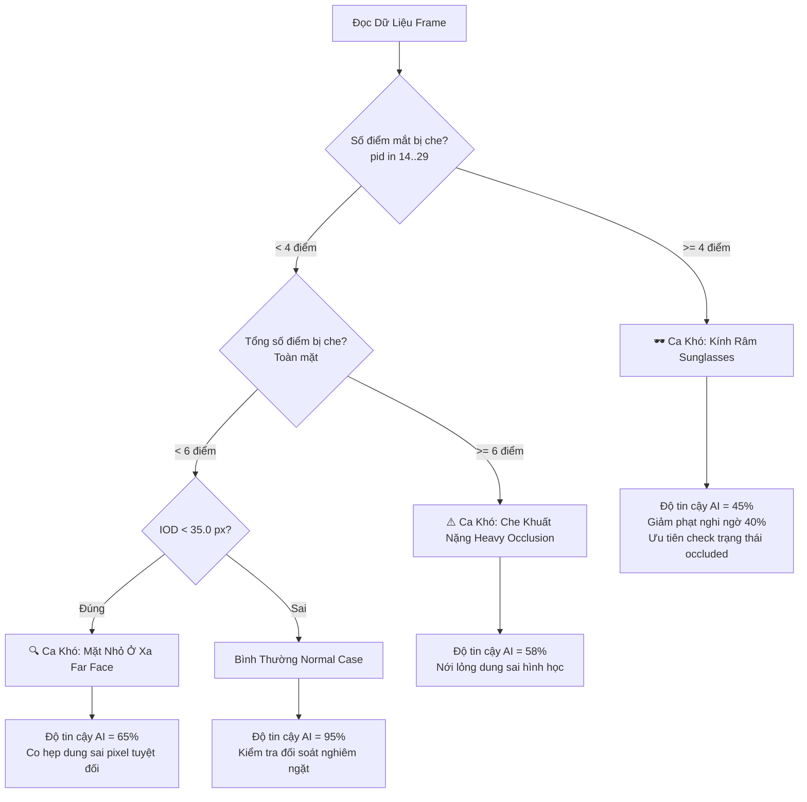

# CẨM NANG TOÀN DIỆN: CÔNG THỨC TOÁN HỌC, THUẬT TOÁN HÌNH HỌC & CÁC CHỈ SỐ METRIC (SCORING & GEOMETRY GUIDE)

> **Căn cứ nghiệp vụ:** Guideline Face Landmark VF-50 v1.3 — VinFast AI Thực Chiến  
> **Mã Schema:** `vf_face_landmark50_v1`  
> **Mục tiêu:** Hệ thống hóa toàn bộ công thức toán học, thuật toán hình học thị giác máy tính, các con số metric ngưỡng (thresholds) và kịch bản bảo vệ chuyên môn trước Mentor.  
> 🔗 **Bản đồ đối chiếu trực tiếp từ màn hình Web UI sang công thức:** Xem tại [07_MAPPING_METRIC_MAN_HINH_VA_CONG_THUC.md](file:///d:/AI-Thuc%20Chien-Vin/Vin-BuildPhase/face_vf50/docs/07_MAPPING_METRIC_MAN_HINH_VA_CONG_THUC.md)

---

## MỤC LỤC
1. [Bối Cảnh Bài Toán Giám Sát Người Lái (DMS Context)](#1-bối-cảnh-bài-toán-giám-sát-người-lái-dms-context)
2. [Thước Đo Chuẩn Hóa Sinh Trắc Học: IOD (Inter-Ocular Distance)](#2-thước-đo-chuẩn-hóa-sinh-trắc-học-iod-inter-ocular-distance)
3. [Chỉ Số KPI Đánh Giá Cốt Lõi: NME (Normalized Mean Error)](#3-chỉ-số-kpi-đánh-giá-cốt-lõi-nme-normalized-mean-error)
4. [Phân Tầng Dung Sai: 12 Điểm Neo (Anchor) vs 38 Điểm Viền (Contour)](#4-phân-tầng-dung-sai-12-điểm-neo-anchor-vs-38-điểm-viền-contour)
5. [Bốn Thuật Toán Hình Học & Thị Giác Máy Tính Cốt Lõi](#5-bốn-thuật-toán-hình-học--thị-giác-máy-tính-cốt-lõi)
   - [5.1. Khử Góc Nghiêng Đầu Bằng Ma Trận Xoay (Head Tilt & 2D Rotation)](#51-khử-góc-nghiêng-đầu-bằng-ma-trận-xoay-head-tilt--2d-rotation)
   - [5.2. Nội Suy Phân Bố Đều Theo Chiều Dài Cung (Arc-Length Polyline Resampling)](#52-nội-suy-phân-bố-đều-theo-chiều-dài-cung-arc-length-polyline-resampling)
   - [5.3. Phát Hiện Đa Giác Tự Cắt Chéo (Self-Intersection Detection via 2D Cross Product)](#53-phát-hiện-đa-giác-tự-cắt-chéo-self-intersection-detection-via-2d-cross-product)
   - [5.4. Bắn Tia Kiểm Tra Điểm Trong Đa Giác (Ray-Casting Point-in-Polygon)](#54-bắn-tia-kiểm-tra-điểm-trong-đa-giác-ray-casting-point-in-polygon)
6. [Cơ Chế Phân Loại Ca Khó (Hard Cases) & Điều Chỉnh Độ Tin Cậy AI](#6-cơ-chế-phân-loại-ca-khó-hard-cases--điều-chỉnh-độ-tin-cậy-ai)
7. [Bảng Tra Cứu Nhanh Các Con Số Metric & Ngưỡng Vàng (Golden Thresholds)](#7-bảng-tra-cứu-nhanh-các-con-số-metric--ngưỡng-vàng-golden-thresholds)
8. [Kịch Bản Trả Lời Vấn Đáp Mentor (Mentor Q&A Defense Script)](#8-kịch-bản-trả-lời-vấn-đáp-mentor-mentor-qa-defense-script)

---

## 1. BỐI CẢNH BÀI TOÁN GIÁM SÁT NGƯỜI LÁI (DMS CONTEXT)

Trong khoang lái thông minh của VinFast, camera DMS (Driver Monitoring System) liên tục ghi hình khuôn mặt tài xế để nhận diện trạng thái mệt mỏi, ngủ gật (Drowsiness) và mất tập trung (Distraction). Dữ liệu này đòi hỏi 50 mốc điểm chính xác tuyệt đối.

### 3 Thách Thức Vật Lý Thực Tế:
1. **Khoảng cách tài xế thay đổi liên tục:** Người ngồi sát vô lăng mặt rất to; người ngả lưng ra sau ghế mặt nhỏ lại. Nếu tính sai số bằng **pixel tuyệt đối** ($L_2$ distance), độ lệch $5\text{px}$ trên mặt to là bình thường, nhưng trên mặt nhỏ ở xa thì điểm đã bay hoàn toàn ra ngoài mắt!
2. **Góc xoay và tư thế đầu biến thiên (Head Pose Variations):** Tài xế liếc gương hậu, quay đầu sang phụ lái $\rightarrow$ Trục khuôn mặt bị nghiêng một góc $\theta$ so với hệ trục tọa độ của ảnh.
3. **Che khuất cục bộ (Occlusion):** Đeo kính râm, kính cận gọng dày, tóc mái che lông mày, tay lái che cằm.

> **Giải pháp kỹ thuật:** Toàn bộ công thức kiểm định phải là **Scale-Invariant (Bất biến tỉ lệ)** chuẩn hóa theo kích thước sinh trắc học khuôn mặt (**IOD**) và **Rotation-Invariant (Bất biến góc quay)** qua ma trận biến đổi tọa độ 2D.

---

## 2. THƯỚC ĐO CHUẨN HÓA SINH TRẮC HỌC: IOD (INTER-OCULAR DISTANCE)

*File mã nguồn:* [geometry.py](file:///d:/AI-Thuc%20Chien-Vin/Vin-BuildPhase/face_vf50/backend/app/qa/geometry.py#L21-L69)

### 2.1. Định Nghĩa & Công Thức Toán Học
**IOD (Khoảng cách gian đồng tử)** là khoảng cách đường chim bay giữa tâm mắt trái ($C_L$) và tâm mắt phải ($C_R$).

#### Bước 1: Tính tâm mắt (Centroid) từ 8 điểm mốc giải phẫu của mỗi mắt
- Tâm mắt trái $C_L$ (điểm 14 đến 21):
  $$C_L = \frac{1}{8} \sum_{i=14}^{21} P_i = \left(\frac{1}{8} \sum_{i=14}^{21} x_i, \; \frac{1}{8} \sum_{i=14}^{21} y_i\right)$$
- Tâm mắt phải $C_R$ (điểm 22 đến 29):
  $$C_R = \frac{1}{8} \sum_{i=22}^{29} P_i = \left(\frac{1}{8} \sum_{i=22}^{29} x_i, \; \frac{1}{8} \sum_{i=22}^{29} y_i\right)$$

#### Bước 2: Tính khoảng cách Euclidean
$$\text{IOD} = \|C_L - C_R\|_2 = \sqrt{(C_{R,x} - C_{L,x})^2 + (C_{R,y} - C_{L,y})^2}$$

*Trên ảnh chuẩn $1280 \times 720$ của VinFast, giá trị trung vị $\text{IOD} \approx 96.0 \text{ px}$ (dao động từ $30\text{px}$ khi xa đến $140\text{px}$ khi gần).*

### 2.2. Cơ Chế Fallback 4 Lớp Chống Mất Điểm (Robust Fallback Chain)
Khi tài xế quay nghiêng đầu hoặc đeo kính râm che mất một phần mắt, hệ thống áp dụng cơ chế suy diễn hình học 4 lớp:
1. **Lớp 1 (Đầy đủ):** Cả 2 mắt có $\ge 4$ điểm hợp lệ $\implies$ Tính trực tiếp từ hai tâm mắt $C_L, C_R$.
2. **Lớp 2 (Khoé ngoài):** Bị mất các điểm mí nhưng còn hai khóe mắt ngoài (điểm 14 và 26) $\implies$ $\text{IOD} \approx \text{Dist}(P_{14}, P_{26}) \times 0.65$ (theo tỉ lệ nhân trắc học khuôn mặt người Á Đông).
3. **Lớp 3 (Bounding Box):** Bị che khuất toàn bộ vùng mắt $\implies$ Tính từ bề rộng khuôn mặt: $\text{IOD} \approx \text{FaceWidth} \times 0.42$.
4. **Lớp 4 (Mặc định):** Fallback về giá trị trung vị của bộ dữ liệu: $\text{IOD} = 96.0 \text{ px}$.

### 2.3. Hệ Số Co Giãn Thích Ứng (Scale Factor)
Dùng để tự động nới lỏng hoặc thắt chặt các ngưỡng pixel trong 14 bộ luật kiểm định:
$$\text{Scale Factor} = \operatorname{clamp}\left(0.25, \; 2.5, \; \frac{\text{IOD}}{96.0}\right)$$

---

## 3. CHỈ SỐ KPI ĐÁNH GIÁ CỐT LÕI: NME (NORMALIZED MEAN ERROR)

*File mã nguồn:* [scoring.py](file:///d:/AI-Thuc%20Chien-Vin/Vin-BuildPhase/face_vf50/backend/app/qa/scoring.py#L15-L84)

### 3.1. Công Thức Toán Học
Sai số chuẩn hóa toàn ảnh được tính bằng trung bình sai số Euclidean của tất cả các điểm hợp lệ, chia cho khoảng cách IOD:

$$\text{NME} = \frac{1}{N \cdot \text{IOD}} \sum_{i=0}^{49} e_i = \frac{1}{N \cdot \text{IOD}} \sum_{i=0}^{49} \sqrt{(x_i^{\text{human}} - x_i^{\text{model}})^2 + (y_i^{\text{human}} - y_i^{\text{model}})^2}$$

*(Trong đó $N \le 50$ là số điểm có mặt trong khung hình, bỏ qua các điểm ngoài biên ảnh `outside`).*

### 3.2. Tiêu Chuẩn Nghiệm Thu Của Ban Tổ Chức (Mục 8 Guideline)

$$\begin{cases} \mathbf{\text{NME} \le 0.035} & \implies \mathbf{PASS} \quad (\text{Đạt chuẩn nghiệm thu nộp bài}) \\ \mathbf{\text{NME} > 0.035} & \implies \mathbf{FAIL} \quad (\text{Vượt ngưỡng, bắt buộc sửa tay trên CVAT}) \end{cases}$$

#### Ý nghĩa vật lý quy đổi ra Pixel:
Với kích thước khuôn mặt trung bình ($\text{IOD} \approx 96 \text{ px}$):
$$\text{Sai số trung bình cho phép} \le 0.035 \times 96 \approx \mathbf{3.36 \text{ pixels}}$$
Nghĩa là sai lệch vị trí giữa nhãn gán và mô hình tham chiếu trung bình trên toàn bộ 50 điểm **không được vượt quá 3.36 pixels**.

---

## 4. PHÂN TẦNG DUNG SAI: 12 ĐIỂM NEO (ANCHOR) VS 38 ĐIỂM VIỀN (CONTOUR)

Ban Tổ Chức không đánh đồng tất cả 50 điểm, mà chia làm 2 cấp bậc giải phẫu:

```
                               50 ĐIỂM LANDMARK VF-50
                                         │
                 ┌───────────────────────┴───────────────────────┐
                 ▼                                               ▼
         12 ĐIỂM NEO (ANCHORS)                        38 ĐIỂM ĐƯỜNG VIỀN (CONTOUR)
     Mốc xương/giải phẫu cố định                   Đường cong phân bố đều (mí, viền môi)
      Dung sai: e_i ≤ 3% × IOD                       Dung sai: e_i ≤ 5% × IOD
         (~2.88 px khi IOD=96)                         (~4.80 px khi IOD=96)
```

### 4.1. Danh Sách 12 Điểm Neo (Anchor Points)
Tập hợp mốc cố định: $\text{Anchors} = \{0, 4, 5, 9, 10, 13, 14, 18, 22, 26, 30, 36\}$
1. **Lông mày (4 điểm):** Điểm đầu (0, 5) và đuôi lông mày (4, 9).
2. **Sống mũi (2 điểm):** Đỉnh gốc mũi giữa 2 mắt (10) và chân sống mũi (13).
3. **Mắt (4 điểm):** Khóe mắt ngoài (14, 26) và khóe mắt trong (18, 22).
4. **Miệng (2 điểm):** Hai góc khóe miệng ngoài (30, 36).

### 4.2. Bảng Phân Tầng Mức Độ Nghiêm Trọng Của Từng Điểm

Với mỗi điểm thứ $i$, sai số chuẩn hóa là $e_{\text{norm}, i} = \frac{e_i}{\text{IOD}}$:

| Phân Loại Điểm | Dung Sai Cho Phép ($\text{Tol}$) | Quy Đổi Pixel ($\text{IOD}=96$) | Mức NORMAL | Mức CẢNH BÁO (WARNING) | Mức NGHIÊM TRỌNG (CRITICAL) |
| :--- | :---: | :---: | :---: | :---: | :---: |
| **Điểm Neo (Anchor)** | **$3\% \times \text{IOD}$** | **$2.88 \text{ px}$** | $e_{\text{norm}} \le 0.03$ | $0.03 < e_{\text{norm}} \le 0.054$ | $e_{\text{norm}} > 0.054$ |
| **Điểm Viền (Contour)**| **$5\% \times \text{IOD}$** | **$4.80 \text{ px}$** | $e_{\text{norm}} \le 0.05$ | $0.05 < e_{\text{norm}} \le 0.090$ | $e_{\text{norm}} > 0.090$ |

---

## 5. BỐN THUẬT TOÁN HÌNH HỌC & THỊ GIÁC MÁY TÍNH CỐT LÕI

### 5.1. Khử Góc Nghiêng Đầu Bằng Ma Trận Xoay (Head Tilt & 2D Rotation)
*File mã nguồn:* [geometry.py](file:///d:/AI-Thuc%20Chien-Vin/Vin-BuildPhase/face_vf50/backend/app/qa/geometry.py#L88-L123) & [rules.py](file:///d:/AI-Thuc%20Chien-Vin/Vin-BuildPhase/face_vf50/backend/app/qa/rules.py#L222-L254)

#### Vấn đề thực tế:
Khi tài xế nghiêng đầu quan sát gương hậu, đường mí mắt bị dốc chéo. Nếu so sánh tọa độ $y$ thông thường trên ảnh (trục $y$ hướng xuống), mí trên sẽ có tọa độ lớn hơn mí dưới, gây ra **báo lỗi giả (false positive)** là mí mắt bị lật ngược.

#### Thuật toán:
1. **Tính góc nghiêng đầu $\theta$ (Radian):**
   $$\theta = \operatorname{atan2}(C_{R,y} - C_{L,y}, \; C_{R,x} - C_{L,x})$$
2. **Xoay ngược góc $-\theta$ quanh trọng tâm khuôn mặt $C = (x_c, y_c)$:**
   $$\begin{bmatrix} x' \\ y' \end{bmatrix} = \begin{bmatrix} \cos(-\theta) & -\sin(-\theta) \\ \sin(-\theta) & \cos(-\theta) \end{bmatrix} \begin{bmatrix} x - x_c \\ y - y_c \end{bmatrix} + \begin{bmatrix} x_c \\ y_c \end{bmatrix}$$
3. **Kiểm tra quy tắc R06 (Mí trên cao hơn mí dưới):**  
   Sau khi xoay về phương ngang, kiểm tra các cặp đối xứng qua con ngươi:
   - Mắt trái: `(15, 21)`, `(16, 20)`, `(17, 19)`
   - Mắt phải: `(23, 29)`, `(24, 28)`, `(25, 27)`
   - Điều kiện chuẩn giải phẫu: $y'_{\text{mí trên}} \le y'_{\text{mí dưới}} + \epsilon_{\text{tol}}$  
   *(Nếu $y'_{\text{mí trên}} > y'_{\text{mí dưới}} + \epsilon \implies$ Phát hiện chính xác lỗi lộn mí bất chấp đầu nghiêng bao nhiêu độ).*

---

### 5.2. Nội Suy Phân Bố Đều Theo Chiều Dài Cung (Arc-Length Polyline Resampling)
*File mã nguồn:* [mapper.py](file:///d:/AI-Thuc%20Chien-Vin/Vin-BuildPhase/face_vf50/backend/app/model/mapper.py#L12-L50)

#### Vấn đề thực tế:
Google MediaPipe Face Mesh xuất ra **478 điểm**, còn VinFast yêu cầu đúng **50 điểm**. Nếu chọn cố định 50 index, khi gặp khuôn mặt có dáng mắt hẹp hay môi mỏng, các điểm sẽ bị dồn cục, mất tính đối xứng và không đều đoạn.

#### Thuật toán:
1. Trích xuất đường gấp khúc $K = [P_0, P_1, \dots, P_m]$ từ MediaPipe cho từng cung giải phẫu (ví dụ mí trên).
2. **Tính chiều dài cung tích lũy (Cumulative Arc-Length):**
   $$\Delta s_k = \|P_{k+1} - P_k\|_2 = \sqrt{(x_{k+1}-x_k)^2 + (y_{k+1}-y_k)^2}$$
   $$S_0 = 0, \quad S_k = \sum_{j=0}^{k-1} \Delta s_j, \quad L = S_m \; (\text{Tổng chiều dài đường cong})$$
3. **Nội suy tuyến tính tại tỉ lệ mục tiêu $f \in [0.0, 1.0]$:**
   - Khoảng cách đích: $d = f \times L$.
   - Tìm chỉ số đoạn $k$ sao cho $S_k \le d \le S_{k+1}$ bằng tìm kiếm nhị phân `searchsorted` ($O(\log m)$).
   - Tọa độ nội suy chính xác:
     $$t = \frac{d - S_k}{S_{k+1} - S_k}, \quad P^*(f) = P_k + t \cdot (P_{k+1} - P_k)$$

*Ví dụ tỉ lệ phân bố mẫu:*
- **Mí trên mắt trái (14 đến 18):** $f \in [0.00, 0.25, 0.50, 0.75, 1.00]$ (5 điểm chia đều bờ mí).
- **Viền môi trên ngoài (30 đến 36):** $f \in [0.0, \frac{1}{6}, \frac{2}{6}, \frac{3}{6}, \frac{4}{6}, \frac{5}{6}, 1.0]$ (7 điểm chia đều cung nhân trung).

---

### 5.3. Phát Hiện Đa Giác Tự Cắt Chéo (Self-Intersection Detection via 2D Cross Product)
*File mã nguồn:* [geometry.py](file:///d:/AI-Thuc%20Chien-Vin/Vin-BuildPhase/face_vf50/backend/app/qa/geometry.py#L125-L157)

#### Vấn đề thực tế:
Khi người gán nhãn nối sai thứ tự điểm quanh mắt hoặc viền môi, đường bao khép kín bị bắt chéo tạo thành hình chữ X hoặc số 8 (lỗi R04/R07).

#### Thuật toán:
Sử dụng hàm hướng **Counter-Clockwise (CCW)** dựa trên tích có hướng 2 chiều (2D Cross Product):
$$\operatorname{ccw}(A, B, C) = (C_y - A_y)(B_x - A_x) > (B_y - A_y)(C_x - A_x)$$
Hai đoạn thẳng không kề nhau $AB$ và $CD$ giao nhau khi và chỉ khi:
$$\operatorname{ccw}(A, C, D) \ne \operatorname{ccw}(B, C, D) \quad \text{AND} \quad \operatorname{ccw}(A, B, C) \ne \operatorname{ccw}(A, B, D)$$
Hệ thống duyệt toàn bộ các cặp cạnh không liền kề trong đa giác. Nếu phát hiện giao nhau $\implies$ Kích hoạt lỗi vi phạm `CRITICAL`.

---

### 5.4. Bắn Tia Kiểm Tra Điểm Trong Đa Giác (Ray-Casting Point-in-Polygon)
*File mã nguồn:* [geometry.py](file:///d:/AI-Thuc%20Chien-Vin/Vin-BuildPhase/face_vf50/backend/app/qa/geometry.py#L159-L179)

#### Vấn đề thực tế:
Đường viền môi trong (42-49) mô tả khoang miệng, bắt buộc phải nằm trọn vẹn bên trong đa giác bờ môi ngoài (30-41) (lỗi R07/R09).

#### Thuật toán:
Từ điểm kiểm tra $P(x_0, y_0)$, bắn một tia nửa đường thẳng nằm ngang sang bên phải hướng trục $+x$:
$$\text{Ray}(t) = (x_0 + t, \; y_0), \quad t \ge 0$$
Đếm số lần tia cắt các cạnh của đa giác môi ngoài:
- Số giao điểm là **LẺ (Odd)** $\implies$ Điểm nằm **BÊN TRONG** $\implies$ **Hợp lệ**.
- Số giao điểm là **CHẴN (Even)** $\implies$ Điểm nằm **BÊN NGOÀI** $\implies$ **Phát hiện lỗi tràn môi**.

---

## 6. CƠ CHẾ PHÂN LOẠI CA KHÓ (HARD CASES) & ĐIỀU CHỈNH ĐỘ TIN CẬY AI

*File mã nguồn:* [scoring.py](file:///d:/AI-Thuc%20Chien-Vin/Vin-BuildPhase/face_vf50/backend/app/qa/scoring.py#L87-L124)

Trong cabin thực tế, không phải lúc nào AI cũng hoàn hảo. Hệ thống phân loại ngữ cảnh thông minh để tránh phạt oan người gán nhãn:



### Chi tiết cách tính điểm nghi ngờ (Suspicion Score):
$$\text{Suspicion} = \min\left(1.0, \; \frac{e_{\text{norm}}}{2.5 \times \text{Tolerance}}\right)$$
- Nếu điểm đó có trạng thái `state = occluded`: Do vị trí bị che đòi hỏi người gán ước lượng giải phẫu, hệ thống tự động **giảm phạt 40%**:
  $$\text{Suspicion}_{\text{final}} = \text{Suspicion} \times 0.6$$

---

## 7. BẢNG TRA CỨU NHANH CÁC CON SỐ METRIC & NGƯỠNG VÀNG (GOLDEN THRESHOLDS)

Bảng tra cứu dùng để trả lời nhanh mọi câu hỏi số liệu từ Hội đồng và Mentor:

| Tham Số Metric | Giá Trị Chuẩn | Đơn Vị | Căn Cứ Guideline | Ý Nghĩa / Nghiệp Vụ Cụ Thể |
| :--- | :---: | :---: | :--- | :--- |
| **Median IOD** | **96.0** | pixel | Mục 8 | Khoảng cách 2 tâm mắt trung vị trên ảnh $1280 \times 720$. Mốc quy đổi pixel. |
| **NME Threshold (KPI)** | $\mathbf{\le 0.035}$ | tỉ lệ IOD | Mục 8 (KPI chính) | Ngưỡng đỗ/trượt bài thi. Tương đương sai số trung bình toàn ảnh $\le 3.36 \text{ px}$. |
| **Anchor Tolerance** | $\mathbf{\le 3\% \times \text{IOD}}$ | px (~$2.88$px) | Mục 5.5, Mục 8 | Dung sai tối đa cho 12 điểm neo giải phẫu cốt lõi. |
| **Contour Tolerance**| $\mathbf{\le 5\% \times \text{IOD}}$ | px (~$4.80$px) | Mục 8 | Dung sai tối đa cho 38 điểm đường cong viền. |
| **Tỉ lệ 3 đoạn sống mũi**| $\mathbf{\le 1.45}$ (Code: $1.55$)| tỉ lệ $\frac{\max}{\min}$ | Mục 3.2, 5.3 | Ba đoạn 10-11, 11-12, 12-13 phải đều nhau. Điểm 13 là chân sống mũi, không kéo xuống chóp mũi. |
| **Bước nhảy Frame (Jitter)**| $\mathbf{\le 15.0 \times \text{Scale}}$ | pixel | Mục 6.9 | Điểm cùng ID giữa 2 frame liên tiếp không được nhảy vọt $> 15\text{px}$ (thực tế trung bình $2.7\text{px}$, $P_{90}=7.7\text{px}$). |
| **Ngưỡng ẩn cả Skeleton**| $< \mathbf{4/8}$ (mắt), $< \mathbf{3/5}$ (mày)| số điểm | Mục 4.2 | Thấy dưới 4 điểm mắt $\rightarrow$ `outside` cả mắt; thấy dưới 3 điểm mày $\rightarrow$ `outside` cả mày. |
| **Điểm trùng tọa độ**| $< \mathbf{0.012 \times \text{IOD}}$ (~$0.4$px)| pixel | Mục 6.2 | Bắt lỗi hai điểm khác nhau bị click đè lên cùng 1 tọa độ khi cùng trạng thái `visible`. |
| **Góc nghiêng khóe mắt**| $\mathbf{\le 45^\circ}$ | độ | Mục 5.2 | Khóe mắt trong và ngoài không được dốc đứng $> 45^\circ$ trừ khi đầu nghiêng hoàn toàn. |

---

## 8. KỊCH BẢN TRẢ LỜI VẤN ĐÁP MENTOR (MENTOR Q&A DEFENSE SCRIPT)

Dưới đây là 4 câu hỏi thực chiến cốt lõi mà Mentor thường xuyên chất vấn:

### Câu Hỏi 1: "Tại sao nhóm em không tính sai số bằng Pixel Distance hay MSE thông thường mà phải dùng NME chia cho IOD?"
> **Câu trả lời chuẩn:**  
> *"Thưa anh/chị, trong camera cabin ô tô (DMS), khoảng cách từ tài xế đến camera luôn thay đổi linh hoạt. Nếu đo bằng khoảng cách pixel thuần túy, cùng một độ lệch 4 pixels: trên khuôn mặt người ngồi gần (IOD = 120px) nó chỉ là sai số nhỏ 3.3%, hoàn toàn chấp nhận được; nhưng trên khuôn mặt người ngồi xa (IOD = 40px) nó chiếm tới 10% IOD và điểm đã bay lệch ra khỏi bờ mí mắt!  
> Việc chia cho IOD giúp sai số trở thành **chỉ số bất biến theo tỉ lệ sinh trắc học (Scale-Invariant)**, phản ánh chính xác chất lượng giải phẫu ở mọi khoảng cách quan sát."*

### Câu Hỏi 2: "Từ 478 điểm dày đặc của Google MediaPipe, làm sao nhóm ánh xạ về đúng 50 điểm của VinFast mà đảm bảo các điểm không bị co cụm dồn cục?"
> **Câu trả lời chuẩn:**  
> *"Thưa anh/chị, nhóm em không dùng phương pháp gán chỉ số index tĩnh, vì khuôn mặt mỗi người có tỉ lệ mắt to/nhỏ hay môi dày/mỏng rất khác nhau. Nhóm em đã xây dựng thuật toán **Arc-Length Polyline Resampling**:  
> Đầu tiên tính tổng chiều dài cung thực tế của từng bộ phận, sau đó thực hiện **nội suy tuyến tính dọc theo chiều dài cung theo các tỉ lệ phần trăm chuẩn hóa $f \in [0.0, 1.0]$**. Cách tiếp cận này đảm bảo hai điểm mút luôn khóa cứng vào mốc giải phẫu cốt lõi ($f=0$ và $f=1$), còn các điểm trung gian luôn tự động rải đều tăm tắp theo đúng độ cong tự nhiên của mí mắt và bờ môi."*

### Câu Hỏi 3: "Khi người lái nghiêng đầu nhìn gương chiếu hậu, làm thế nào hệ thống kiểm tra được mí trên có bị lộn xuống dưới mí dưới mà không bị báo lỗi giả?"
> **Câu trả lời chuẩn:**  
> *"Thưa anh/chị, nếu chỉ so sánh trục y của bức ảnh thì khi đầu nghiêng góc $30^\circ - 45^\circ$, mí trên của mắt bên thấp sẽ tự nhiên có tọa độ y lớn hơn mí dưới, gây ra báo lỗi giả hàng loạt.  
> Thuật toán của nhóm em giải quyết bằng 2 bước:  
> 1. Tính góc nghiêng đầu $\theta$ thông qua hàm $\operatorname{atan2}$ từ véc-tơ nối hai tâm mắt.  
> 2. Nhân tọa độ với **ma trận xoay 2D ngược góc $-\theta$** quanh trọng tâm khuôn mặt để đưa toàn bộ hệ tọa độ về phương nằm ngang chuẩn.  
> Sau khi đã triệt tiêu góc nghiêng đầu, hệ thống mới kiểm tra điều kiện hình học $y'_{\text{mí trên}} \le y'_{\text{mí dưới}}$, đảm bảo tính chính xác tuyệt đối."*

### Câu Hỏi 4: "Con số NME $\le 0.035$ và dung sai 3% - 5% có ý nghĩa vật lý như thế nào trên ảnh thực tế?"
> **Câu trả lời chuẩn:**  
> *"Thưa anh/chị, trên ảnh chuẩn $1280 \times 720$ với IOD trung vị khoảng $96\text{px}$:*
> - *Ngưỡng **$\text{NME} \le 0.035$** là KPI nghiệm thu của Ban Tổ Chức, tương đương sai số bình quân mỗi điểm $\le 0.035 \times 96 \approx \mathbf{3.36 \text{ pixels}}$.*
> - *Dung sai **3% IOD cho 12 điểm neo** tương đương $\le \mathbf{2.88 \text{ pixels}}$, áp dụng cho các mốc giải phẫu bất biến như khóe mắt, khóe môi, gốc sống mũi.*
> - *Dung sai **5% IOD cho 38 điểm đường viền** tương đương $\le \mathbf{4.80 \text{ pixels}}$, cho phép độ uốn lượn linh hoạt theo đường viền tự nhiên của bờ mí và môi."*
