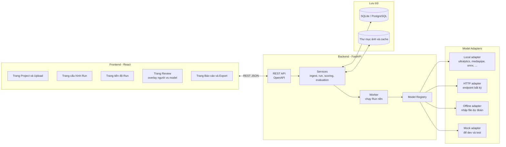
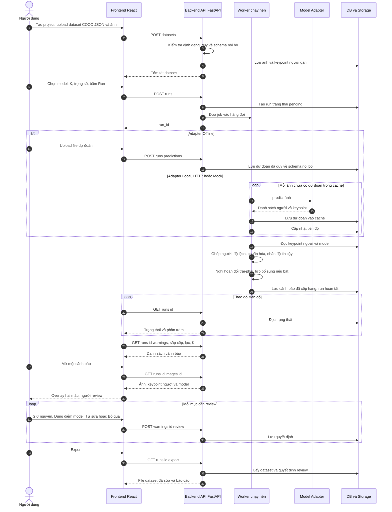

# Landmark QA (Web) — Phát hiện điểm nghi ngờ bằng so sánh Model vs Người gán nhãn

> Bản thiết kế dạng **web app tách Backend / Frontend**, với **lớp model tự do (model-agnostic)**: hệ thống không gắn cứng vào YOLO-pose, có thể cắm bất kỳ model nào (chạy local, gọi HTTP/API, hoặc nhập sẵn file dự đoán).
> **Ý tưởng cốt lõi:** một model dự đoán lại keypoint, **so tọa độ model với tọa độ người gán**, điểm nào lệch nhau nhiều nhất thì đưa lên đầu danh sách **nghi ngờ** để người review.
> **Phạm vi:** chưa xử lý guideline/notes (để ở phần mở rộng). Kết quả là **"nghi ngờ"**, không phải "chắc chắn sai".

---

## 1. Vấn đề

Nhãn keypoint (17 khớp người, 68/98 điểm mặt) rất tốn công và dễ sai: click lệch, nhầm trái/phải, bỏ sót. Review thủ công từng điểm trên hàng nghìn ảnh gần như không khả thi.

**Câu hỏi cốt lõi:** trong N ảnh đã gán keypoint, **điểm nào của ảnh nào** đáng nghi nhất để người review lại?

## 2. Ý tưởng

```
Dataset đã label (người gán)  ─┐
                               ├─► So tọa độ từng điểm ─► Điểm lệch nhiều ─► Top-K nghi ngờ ─► Người review (web)
Model bất kỳ dự đoán lại     ─┘
```

**Kiến trúc thuật toán: 1 lớp chính + 1 lớp bổ sung (tùy chọn)**

| Lớp | Việc | Bắt buộc? |
|---|---|---|
| **Lớp chính: Model vs Người** | So tọa độ model với tọa độ đã gán, chuẩn hóa, nhân độ tin cậy | **Có** |
| **Lớp bổ sung: Hình học và Shape** | Rule hình học + PCA shape model chỉ dựa trên tọa độ | Không, làm khi còn thời gian |

---

## 3. Kiến trúc hệ thống (tách BE / FE)



**Nguyên tắc thiết kế:**
- **FE và BE chỉ nói chuyện qua REST API** (OpenAPI). Có hợp đồng API từ ngày 1 thì FE và BE làm song song được.
- **Lõi thuật toán (scoring) không biết model là gì**: nó chỉ nhận dự đoán ở **schema nội bộ thống nhất**. Đổi model không đụng đến scoring, dashboard hay báo cáo.
- **Run chạy nền (worker)** vì dự đoán nhiều ảnh mất thời gian; FE theo dõi tiến độ bằng polling (hoặc SSE).
- **Cache dự đoán** theo cặp (dataset, model): chạy model một lần, chấm điểm lại nhiều lần với tham số khác.

---

## 4. Lớp model tự do (Model Adapter)

### 4.1 Hợp đồng chung

Mọi model, dù chạy kiểu nào, đều phải quy về cùng một đầu ra:

```python
class ModelAdapter(Protocol):
    name: str
    keypoint_schema: KeypointSchema      # tên khớp, cặp trái-phải, skeleton

    def predict(self, image: np.ndarray) -> list[PersonPrediction]:
        ...

class PersonPrediction(BaseModel):
    bbox: tuple[float, float, float, float] | None   # x1, y1, x2, y2 (nếu có)
    score: float | None                              # độ tin cậy cả người (nếu có)
    keypoints: list[Keypoint]                        # x, y, confidence (nếu có)

class Keypoint(BaseModel):
    x: float
    y: float
    conf: float | None = None
```

- **Không có `conf`** thì hệ thống dùng `conf = 1.0`, lúc đó bỏ qua việc nhân độ tin cậy, chỉ còn độ lệch chuẩn hóa (chất lượng xếp hạng giảm nhưng vẫn chạy).
- **Không có `bbox`** thì suy ra từ keypoint (khung bao các điểm) để làm thước đo kích thước và ghép người.

### 4.2 Bốn loại adapter

| Adapter | Cách hoạt động | Khi nào dùng |
|---|---|---|
| **Local** | BE gọi thư viện Python trực tiếp (ultralytics, mediapipe, onnxruntime, torch...) | Có sẵn model, chạy trên máy/server của bạn |
| **HTTP** | BE gửi ảnh tới một endpoint theo hợp đồng, nhận JSON | Model nằm ở dịch vụ khác (server GPU riêng, API bên thứ ba, model tự host) |
| **Offline** | Người dùng **upload file dự đoán** (định dạng COCO results hoặc JSON theo schema nội bộ) | Đã chạy model ở nơi khác (Colab, máy khác), không muốn BE chạy model. Không cần runtime model trên BE |
| **Mock** | Trả về nhãn người **cộng nhiễu** | FE/BE phát triển và test khi chưa chọn model; demo pipeline sớm |

**Adapter Offline rất quan trọng cho hackathon:** cho phép team chọn model muộn, chạy ở đâu cũng được, chỉ cần xuất file dự đoán.

### 4.3 Hợp đồng cho HTTP adapter

Nếu model đặt sau một endpoint, chỉ cần khớp hợp đồng đơn giản này:

```
POST {endpoint}/predict
Content-Type: multipart/form-data   (file: ảnh)

Response 200:
{
  "persons": [
    {
      "bbox": [x1, y1, x2, y2],
      "score": 0.93,
      "keypoints": [ {"x": 312.0, "y": 205.5, "conf": 0.94}, ... ]
    }
  ]
}
```

Nếu API thật có định dạng khác, viết một **hàm chuyển đổi (mapper)** trong config thay vì sửa lõi.

### 4.4 Ánh xạ sơ đồ điểm (keypoint schema mapping)

Model và dataset có thể dùng sơ đồ điểm khác nhau (VD MediaPipe 33 điểm vs COCO 17 điểm). Cấu hình ánh xạ trong YAML:

```yaml
# models.yaml
models:
  - id: yolo_pose_local
    type: local
    class: adapters.ultralytics_pose.UltralyticsPose
    params: { weights: "yolo11n-pose.pt", device: "cpu" }
    schema: coco17            # trùng với dataset, không cần ánh xạ

  - id: mediapipe_pose
    type: local
    class: adapters.mediapipe_pose.MediaPipePose
    schema: mediapipe33
    map_to: coco17            # dùng bảng ánh xạ 33 → 17
    mapping: configs/mapping_mediapipe33_to_coco17.yaml

  - id: my_gpu_server
    type: http
    endpoint: "http://10.0.0.5:8000"
    schema: coco17
    timeout_s: 30
    max_retries: 2

  - id: offline_upload
    type: offline
    schema: coco17
```

Điểm không ánh xạ được (model không có điểm đó) bị **bỏ qua khi so sánh**, không tính là lỗi.

### 4.5 Ghi chú vận hành

- Cache dự đoán vào DB để không chạy lại; chạy lại khi đổi model hoặc phiên bản weights.
- HTTP adapter cần **timeout, retry, giới hạn song song** để không làm treo Run.
- Gửi ảnh ra dịch vụ ngoài: chỉ dùng dữ liệu công khai khi demo.

---

## 5. Thuật toán chấm điểm (không phụ thuộc model)

### Bước 1 — Ghép người gán với người model

Ảnh nhiều người: ghép bằng bbox (IoU) hoặc OKS cao nhất, chỉ so cặp đã ghép. Người không ghép được thì đánh dấu riêng ("model không thấy người này" / "model thấy người chưa được gán"), không đưa vào xếp hạng điểm.

### Bước 2 — Độ lệch và chuẩn hóa

Với mỗi điểm người **đã gán**:
1. `d = khoảng cách Euclid(p_người, p_model)`
2. `d_norm = d / scale` (scale = căn bậc hai diện tích bbox, hoặc chiều dài thân)
3. `z = (d_norm − median_loại_điểm) / MAD_loại_điểm` (mức lệch bất thường **so với chính loại điểm đó** trên cả dataset)

### Bước 3 — Điểm nghi ngờ

```
điểm nghi ngờ = z_chuẩn_hóa (đưa về 0..1) × độ tin cậy của model
```

| Tình huống | Nhãn hiển thị |
|---|---|
| Lệch lớn + model **tự tin** | **Nghi sai** (ưu tiên cao) |
| Lệch lớn + model **không tự tin** | **Điểm khó** (ưu tiên thấp hơn) |
| Lệch nhỏ | Không báo |

### Bước 4 — Nghi hoán đổi trái-phải

Với mỗi cặp trái-phải, so tổng lệch khi **giữ nguyên** và khi **đổi chỗ**. Nếu đổi chỗ nhỏ hơn rõ rệt → cảnh báo **"nghi hoán đổi trái-phải"** cho cả cặp. Cặp trái-phải lấy từ `keypoint_schema`.

### Bước 5 — Lớp bổ sung (tùy chọn): Hình học và Shape

Chỉ dùng tọa độ người gán: rule hình học (tỷ lệ xương, đối xứng, góc khớp, trong bbox) và PCA shape model (Procrustes + reconstruction error theo điểm).
`điểm_cuối = w1 × điểm_model + w2 × điểm_shape` (bắt đầu 0.7 / 0.3), thưởng khi hai lớp cùng chỉ vào một điểm.

### Bước 6 — Xếp hạng

- **Mức keypoint:** xếp toàn bộ điểm theo điểm nghi ngờ, lấy top-K
- **Mức ảnh:** trung bình 3 điểm nghi ngờ cao nhất của ảnh (hoặc giá trị lớn nhất)
- **K do người dùng chọn:** "review được 200 điểm" hoặc "top 5%". Xếp hạng lưu sẵn, K chỉ là bộ lọc lúc xem nên đổi K không cần chạy lại.

---

## 6. Sequence diagram



---

## 7. Thiết kế API (REST, sinh OpenAPI tự động)

| Method | Endpoint | Việc |
|---|---|---|
| `POST` | `/api/projects` | Tạo project |
| `GET` | `/api/projects` | Danh sách project |
| `POST` | `/api/projects/{id}/datasets` | Upload dataset (COCO JSON + ảnh dạng zip hoặc thư mục) |
| `GET` | `/api/datasets/{id}` | Tóm tắt dataset (số ảnh, số người, số keypoint) |
| `GET` | `/api/models` | Danh sách model đã đăng ký (từ `models.yaml`) |
| `POST` | `/api/models` | Đăng ký thêm HTTP endpoint (tùy chọn) |
| `POST` | `/api/runs` | Tạo Run: `dataset_id`, `model_id`, tham số chấm điểm |
| `POST` | `/api/runs/{id}/predictions` | Upload file dự đoán (adapter Offline) |
| `GET` | `/api/runs/{id}` | Trạng thái và tiến độ Run |
| `GET` | `/api/runs/{id}/warnings` | Danh sách cảnh báo (phân trang, sắp xếp, lọc theo loại/điểm/ngưỡng/K) |
| `GET` | `/api/runs/{id}/images/{image_id}` | Chi tiết một ảnh: keypoint người, model, cảnh báo |
| `GET` | `/api/images/{image_id}/file` | Tệp ảnh |
| `POST` | `/api/warnings/{id}/review` | Lưu quyết định review (`keep`, `use_model`, `manual` + tọa độ, `skip`) |
| `GET` | `/api/runs/{id}/summary` | Số liệu tổng hợp cho trang báo cáo |
| `GET` | `/api/runs/{id}/evaluation` | Precision@K, ablation (khi có ground truth noise) |
| `GET` | `/api/runs/{id}/export` | Xuất dataset đã sửa + báo cáo |

**Ví dụ một cảnh báo (JSON trả về):**

```json
{
  "id": 1042,
  "image_id": 123,
  "person_id": 1,
  "keypoint": "left_elbow",
  "warning_type": "suspected_error",
  "suspicion": 0.91,
  "human_xy": [312.0, 205.5],
  "model_xy": [341.2, 232.8],
  "normalized_deviation": 0.31,
  "z_score": 3.2,
  "model_confidence": 0.94,
  "reasons": ["Lệch 3.2 lần mức bình thường của loại điểm này", "Model tự tin cao"],
  "review": null
}
```

**Mô hình dữ liệu (rút gọn):** `projects` · `datasets` · `images` · `annotations` (người, keypoint JSON) · `models` · `runs` · `predictions` (cache theo run/model) · `warnings` · `reviews`.

---

## 8. Frontend

| Trang | Nội dung |
|---|---|
| **Project / Upload** | Tạo project, upload dataset, xem tóm tắt |
| **Cấu hình Run** | Chọn model (từ danh sách adapter), chọn K, trọng số, bật/tắt lớp bổ sung, hoặc upload file dự đoán |
| **Tiến độ Run** | Thanh tiến độ, số ảnh đã xử lý, lỗi (nếu có) |
| **Review** | Trái: danh sách cảnh báo (lọc theo loại điểm, loại cảnh báo, ngưỡng, K). Phải: **ảnh với overlay hai màu** (xanh = người gán, đỏ = model, nối bằng đoạn thẳng), nút hành động, phím tắt |
| **Báo cáo / Export** | Biểu đồ phân bố cảnh báo, tiến độ review, Precision@K và ablation, nút export |

**Chi tiết đáng làm cho trải nghiệm review:**
- Phím tắt (K giữ nguyên, M dùng điểm model, S bỏ qua, mũi tên chuyển mục) để review nhanh
- Kéo thả điểm trực tiếp trên canvas để tự sửa tọa độ
- Bật/tắt hiển thị từng lớp (người, model, skeleton)
- Hiển thị lý do cảnh báo và độ tin cậy ngay cạnh điểm

---

## 9. Công nghệ

| Nhóm | Công nghệ | Ghi chú |
|---|---|---|
| **FE** | React + TypeScript + Vite | Không cần SSR nên Vite gọn hơn Next.js |
| | TanStack Query | Gọi API, cache, polling tiến độ |
| | Tailwind CSS | Dựng UI nhanh |
| | Canvas hoặc SVG (hoặc `react-konva`) | Vẽ overlay, kéo thả điểm |
| | Recharts | Biểu đồ báo cáo |
| | `openapi-typescript` | Sinh kiểu TS từ OpenAPI của BE, tránh lệch hợp đồng |
| **BE** | Python 3.10+, FastAPI | OpenAPI tự sinh, hợp với numpy/pandas |
| | Pydantic | Schema nội bộ, kiểm tra dữ liệu |
| | SQLAlchemy hoặc SQLModel | Truy cập DB |
| | `numpy`, `scipy`, `pandas`, `scikit-learn` | Chấm điểm, PCA |
| | `opencv-python`, `Pillow` | Đọc/cắt ảnh |
| | Worker: `BackgroundTasks` hoặc thread/process pool | Đủ cho hackathon. Nâng cấp sau: Celery + Redis |
| **Model** | Tùy adapter: `ultralytics`, `mediapipe`, `onnxruntime`, `httpx` | Chỉ cài cái đang dùng |
| **Lưu trữ** | SQLite (bắt đầu), PostgreSQL (nếu cần) | Ảnh và cache trong thư mục |
| **Hạ tầng** | Docker Compose (be + fe) | Chạy demo giống nhau trên mọi máy |

**Không cần trong hackathon:** đăng nhập/phân quyền, đa người dùng đồng thời, Kubernetes, hàng đợi phân tán.

### Cấu trúc repo gợi ý

```
landmark-qa/
├── backend/
│   ├── app/
│   │   ├── main.py
│   │   ├── api/                 # routers: projects, datasets, models, runs, warnings
│   │   ├── schemas/             # Pydantic: schema nội bộ, request/response
│   │   ├── services/
│   │   │   ├── ingest.py        # COCO JSON → schema nội bộ
│   │   │   ├── run_service.py   # điều phối Run, cập nhật tiến độ
│   │   │   ├── match.py         # ghép người gán với người model
│   │   │   ├── scoring.py       # độ lệch, chuẩn hóa, hoán đổi trái-phải
│   │   │   ├── shape.py         # lớp bổ sung (tùy chọn)
│   │   │   ├── evaluation.py    # Precision@K, ablation
│   │   │   └── export.py
│   │   ├── adapters/
│   │   │   ├── base.py          # ModelAdapter, PersonPrediction
│   │   │   ├── registry.py      # đọc models.yaml, tạo adapter
│   │   │   ├── ultralytics_pose.py
│   │   │   ├── mediapipe_pose.py
│   │   │   ├── http_adapter.py
│   │   │   ├── offline_adapter.py
│   │   │   └── mock_adapter.py
│   │   └── db/                  # models, session
│   ├── configs/
│   │   ├── models.yaml
│   │   ├── coco17.yaml          # tên khớp, cặp trái-phải, skeleton
│   │   └── mapping_*.yaml
│   ├── scripts/
│   │   └── inject_noise.py      # tạo lỗi giả lập + ground truth
│   └── tests/
├── frontend/
│   └── src/
│       ├── pages/               # Project, RunConfig, RunProgress, Review, Report
│       ├── components/          # OverlayCanvas, WarningList, Filters
│       ├── api/                 # client sinh từ OpenAPI
│       └── ...
├── docker-compose.yml
└── README.md
```

---

## 10. Cách chứng minh hiệu quả (demo)

### Tránh rò rỉ dữ liệu train
Model có thể đã thấy dataset của bạn lúc train và "nhớ" cả nhãn sai. Dùng **tập ảnh model chưa từng train** (kiểm tra tài liệu của model bạn chọn; ví dụ model train trên COCO thì dùng phần ảnh giữ lại để đánh giá như val2017), hoặc dataset khác có cùng sơ đồ điểm.

### Inject noise có kiểm soát (`inject_noise.py`)

| Loại noise | Cách giả lập |
|---|---|
| Lệch nhỏ | Nhiễu Gaussian vào vài keypoint |
| Lệch lớn | Dời một keypoint xa vị trí đúng |
| Hoán đổi trái-phải | Đổi vị trí một cặp điểm |
| Nhảy sang người khác | Chuyển keypoint sang người bên cạnh |

Script lưu **ground truth** vị trí lỗi để `evaluation.py` tính chỉ số.

### Chỉ số và biểu đồ
- **Precision@K / Recall@K** mức keypoint và mức ảnh
- **Đường cong so với review ngẫu nhiên**
- **Ablation:** độ lệch thô → chuẩn hóa → × độ tin cậy → + lớp bổ sung
- **So sánh giữa các model:** vì lớp model tự do, có thể chạy **cùng dataset với 2–3 model khác nhau** và so kết quả. Đây là điểm cộng riêng của thiết kế này.
- **Điểm cộng:** xem tay top 20–30 điểm để tìm **nhãn sai thật trong dataset gốc** (trình bày riêng, vì sẽ bị tính là báo nhầm trong Precision@K so với noise đã inject)

---

## 11. Plan 1–2 tuần cho 3 người

**Nguyên tắc: hợp đồng trước, làm song song sau.** Ngày 1 chốt schema nội bộ + danh sách API + dữ liệu mẫu, để FE không phải chờ BE.

| Ngày | BE và hạ tầng (A) | Model và thuật toán (B) | Frontend (C) |
|---|---|---|---|
| 1 | Khung FastAPI, DB, chốt OpenAPI, Docker Compose | Chốt schema nội bộ + `ModelAdapter`, viết **Mock adapter** | Khung React, dựng client từ OpenAPI, dữ liệu giả |
| 2 | `ingest.py`, API projects/datasets, lưu ảnh | Adapter đầu tiên (Local hoặc Offline, tùy model chọn) | Trang Project/Upload, trang cấu hình Run |
| 3 | API runs + worker nền + tiến độ | `match.py` (ghép người) | Trang tiến độ Run |
| 4 | API warnings, images, review | `scoring.py`: độ lệch, chuẩn hóa, độ tin cậy | Trang Review: danh sách + lọc |
| 5 | Export, lưu quyết định review | Nghi hoán đổi trái-phải | Trang Review: canvas overlay hai màu |
| 6 | HTTP adapter (timeout, retry), Offline adapter | `inject_noise.py` + `evaluation.py` | Kéo thả sửa điểm, phím tắt |
| 7 | Tích hợp end-to-end, sửa lỗi | Ablation, tinh chỉnh trọng số | Trang Báo cáo (biểu đồ) |
| 8 | Chạy thử với model thứ hai (kiểm chứng "model tự do") | Xem tay top-K tìm lỗi thật trong nhãn gốc | Polish UI, trạng thái lỗi/rỗng |
| 9 | (Tùy chọn) Lớp bổ sung Hình học và Shape | Polish demo, số liệu | Slide và kịch bản trình bày (cả 3) |
| 10+ | Buffer, rehearsal | | |

**Nếu thiếu thời gian, cắt theo thứ tự:** lớp bổ sung Shape → HTTP adapter (giữ Local/Offline) → kéo thả sửa điểm → trang Báo cáo chi tiết → mức ảnh. **Giữ lại:** upload → chạy → danh sách top-K → overlay hai màu → review → export, cùng Precision@K.

## 12. Tiêu chí thành công

- Upload dataset, chọn model, bấm chạy, nhận danh sách top-K điểm nghi ngờ kèm lý do trên web
- **Đổi sang model khác chỉ bằng cấu hình** (hoặc upload file dự đoán), không sửa lõi
- Overlay hai màu, review và export hoạt động
- Có Precision@K/Recall@K theo loại lỗi, đường so với ngẫu nhiên, ablation
- Có ít nhất vài ví dụ nhãn sai thật được tìm ra

---

## 13. Rủi ro và giới hạn cần nói thẳng với mentor

**Về phương pháp:**
- **Lệch nhau không có nghĩa người sai:** chỉ cho biết "đáng xem lại", không cho biết ai đúng
- **Khác biệt quy ước gán nhãn:** nếu model theo quy ước khác project của bạn, độ lệch sẽ nhất quán trên cả dataset và tạo hàng loạt báo nhầm (kiểm tra tay một mẫu nhỏ trước). Đây là lý do sau này cần guideline
- **Người và model cùng sai giống nhau** thì không bị báo
- **Rò rỉ dữ liệu train** (xem mục 10)
- **Độ tin cậy của model không được hiệu chỉnh chặt chẽ** và **khác nhau giữa các model** → trọng số cần tinh chỉnh lại khi đổi model. Model không có `conf` thì chất lượng xếp hạng giảm
- **Tư thế hiếm, bị che, mờ** làm model sai nhiều hơn → tăng báo nhầm (đã giảm bằng nhãn "Điểm khó")
- **Ghép người khi ảnh đông người** sai sẽ tạo lệch giả lớn

**Về kỹ thuật web / model tự do:**
- **Tách BE-FE làm tăng khối lượng** (API, CORS, upload ảnh lớn, đồng bộ hợp đồng). Giảm rủi ro bằng cách chốt OpenAPI ngày 1 và dùng Mock adapter để FE không bị chặn
- **Suy luận trên CPU chậm** với nhiều ảnh → cache, chạy nền, hiển thị tiến độ, thử trên tập nhỏ trước
- **HTTP adapter** cần timeout, retry, giới hạn song song; dịch vụ ngoài có thể chậm hoặc lỗi giữa chừng
- **Ánh xạ sơ đồ điểm sai** (VD 33 → 17) sẽ tạo lệch giả → có test cho bảng ánh xạ
- **Ảnh gửi ra dịch vụ ngoài** liên quan quyền riêng tư → chỉ dùng dữ liệu công khai khi demo
- **Inject noise ≠ lỗi thật:** kết quả trên noise giả lập có thể lạc quan hơn thực tế

---

## 14. Hướng mở rộng sau MVP

| Mở rộng | Giá trị | Ghi chú |
|---|---|---|
| **Guideline Rule Engine** (`rules.yaml` + notes) | Bắt lỗi vi phạm quy ước project, giải quyết vấn đề "khác quy ước" | LLM text có thể hỗ trợ chuyển guideline thành YAML, người phải xác nhận |
| **Kiểm tra cờ visibility** | Bắt lỗi gán sai visible/occluded | So độ tin cậy model với cờ đã gán |
| **Face landmarks** | Mở rộng sang 68/98 điểm mặt | Chỉ cần thêm `keypoint_schema` và adapter có cùng sơ đồ điểm |
| **VLM làm adapter kiểm tra occlusion** | Xác nhận điểm có bị che theo từng điểm | Chỉ gọi cho top-K, cache kết quả |
| **Nhiều model cùng lúc (ensemble)** | Điểm nghi ngờ tin cậy hơn khi nhiều model cùng bất đồng với người | Nhờ thiết kế adapter, thêm được ít công |
| **Đa người dùng, phân việc review** | Dùng thật cho team annotation | Cần auth, hàng đợi phân tán (Celery + Redis) |
